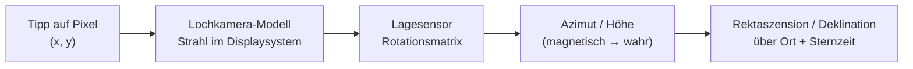

# StarWindow

Android-App (Kotlin / Jetpack Compose), mit der man mit der Handykamera einen **Himmelsausschnitt
einzeichnet** – ein „Fenster“ zwischen Dächern, Bäumen oder Bergen – und diesen Ausschnitt exakt in
Himmelskoordinaten festhält. Aus diesem Fenster lässt sich anschließend berechnen, **welche
Objekte im Lauf der Nacht hindurchziehen und wie lange** sie darin sichtbar sind.

Der Stand ist bewusst ein tragfähiger Anfang: Kamera, Kompass, Fenstergeometrie und die
Koordinaten-Zuordnung sind fertig und getestet, der Katalogteil läuft mit einem mitgelieferten
Basiskatalog und ist für Online-Kataloge vorbereitet.

---

## In Android Studio öffnen

1. Repository klonen, in Android Studio über **File → Open** das Projektverzeichnis wählen.
2. Android Studio legt `local.properties` mit dem SDK-Pfad automatisch an.
3. Gradle-Sync abwarten, dann `app` auf einem **echten Gerät** starten – Emulatoren haben weder
   brauchbaren Kompass noch Kamera für den Himmel.

Anforderungen: Android Studio Ladybug oder neuer, JDK 17, Android SDK 35, minSdk 26.

```
./gradlew :app:assembleDebug     # APK bauen
./gradlew :app:testDebugUnitTest # 54 Unit-Tests
```

---

## Wie die Zuordnung zum Himmel funktioniert

Das ist der Kern der App. Ein Fingertipp auf den Bildschirm wird über vier Schritte zu einer
Himmelsrichtung:



1. **Lochkamera-Modell** – Aus `CameraCharacteristics` (Brennweite und physische Sensorgröße)
   ergibt sich das Bildfeld, daraus die Brennweite in Bildschirmpixeln. Der Vorschaustrom wird mit
   `FIT_CENTER` angezeigt, nicht mit `FILL_CENTER`: der Beschnitt von `FILL_CENTER` hängt vom
   Seitenverhältnis des Geräts ab und wäre ein direkter Fehler im Grad-pro-Pixel-Maßstab.
2. **Lage des Geräts** – Der fusionierte `TYPE_ROTATION_VECTOR` liefert eine Rotationsmatrix, die
   für die aktuelle Displaydrehung umgerechnet wird (funktioniert also auch im Querformat) und
   über eine Quaternionen-Glättung läuft, damit die Markierungen nicht zittern.
3. **Wahr statt magnetisch** – Über `GeomagneticField` kommt die Ortsmissweisung dazu; erst danach
   ist der Azimut auf geografisch Nord bezogen.
4. **Himmelskoordinaten** – Mit Breite, Länge und mittlerer Ortssternzeit (GMST nach IAU 1982)
   wird Azimut/Höhe in Rektaszension/Deklination umgerechnet.

Rückwärts läuft dieselbe Kette: Deshalb bleiben gesetzte Punkte beim Schwenken **auf ihrem Stern
kleben** – sie werden jedes Bild neu aus Himmelskoordinaten projiziert, nicht als Bildschirmpunkte
gespeichert. Das ist gleichzeitig die eingebaute Sichtprüfung: Wandert eine Markierung beim
Schwenken schneller oder langsamer als das Kamerabild, stimmt das Bildfeld nicht.

### Bildfeld kalibrieren

Manche Geräte melden ihre Optik ungenau. In den Einstellungen (Zahnrad) gibt es dafür einen
Feinjustierungs-Faktor:

1. Einen hellen Stern oder eine markante Kante an den Bildrand bringen.
2. Schwenken und beobachten, ob die eingeblendete Katalogmarkierung mitläuft.
3. Läuft die Markierung schneller als das Bild → Faktor erhöhen, sonst verringern.

---

## Fenster zeichnen

Drei Modi, jeweils per Antippen im Sucher:

| Modus | Punkte | Ergebnis |
|---|---|---|
| **Polygon** | ab 3 | freie Kontur, auch konkav (z. B. eine Dachlücke) |
| **Kreis** | 2 | 1. Tipp Mittelpunkt, 2. Tipp Rand |
| **Rechteck** | 2 | in Azimut/Höhe ausgerichteter Kasten |

Fenster werden **in Azimut/Höhe** gespeichert, also fest gegenüber dem Horizont. Genau das ist die
physikalisch richtige Beschreibung einer Lücke zwischen zwei Häusern – der Himmel dreht sich
hindurch, und darauf beruht die Durchgangsberechnung.

Zusätzlich zeigt die Detailansicht, wo die Fenstermitte zum Aufnahmezeitpunkt und jetzt am
Sternhimmel steht (RA/Dec), zusammen mit Ort, Missweisung und Kompassgüte.

---

## Durchgangsberechnung

`TransitCalculator` tastet den gewünschten Zeitraum in 60-Sekunden-Schritten ab, prüft für jedes
Katalogobjekt die Zugehörigkeit zum Fenster und schachtelt jeden Ein- und Austritt per Bisektion
auf unter eine Sekunde ein. Abtasten statt analytisch lösen, weil das Fenster ein beliebiges
Polygon sein darf – dafür gibt es keine geschlossene Lösung.

* Objekte, deren Deklination von diesem Breitengrad aus die Höhe des Fensters nie erreicht, werden
  vorab aussortiert.
* Die Positionen enthalten atmosphärische Refraktion (Bennett), passend dazu, dass das Fenster
  anhand des Kamerabildes gezeichnet wurde.
* Ergebnis pro Objekt: Eintritt, Austritt, Dauer, höchste erreichte Höhe.

---

## Kataloge

Mitgeliefert ist `app/src/main/assets/catalog/starwindow_core.json` mit 115 Objekten (helle Sterne,
Messier-Auswahl, einige NGC/IC-Objekte, J2000). Das reicht, um die ganze Kette zu benutzen und zu
prüfen, ohne Netz.

Für Online-Kataloge steht das Interface `CatalogSource` bereit; `RemoteCatalogSource` ist ein
bewusst leerer Platzhalter mit der geplanten VizieR/SIMBAD-TAP-Abfrage im Kommentar. Der sinnvolle
nächste Schritt ist, ihn zusammen mit einem Offline-Cache zu bauen – im Feld gibt es kein Netz.

---

## Projektaufbau

```
app/src/main/java/com/starwindow/app/
├── core/
│   ├── astro/       Zeit, Koordinaten, Transformationen  (reine Mathematik, testbar)
│   ├── geometry/    Kugelgeometrie, Fensterformen
│   ├── camera/      Kameraoptik, Bildschirm ⇄ Himmel
│   └── sensors/     Lage- und Standortverfolgung
├── data/
│   ├── catalog/     Katalogquellen und -modell
│   └── windows/     Persistenz (JSON) und Einstellungen
├── domain/          Durchgangsberechnung
└── ui/              Compose-Oberfläche (Kamera, Liste, Detail)
```

`core/` hat bis auf die Sensorschicht keine Android-Abhängigkeiten – deswegen laufen die Tests als
normale JVM-Unit-Tests ohne Emulator.

Bewusste Entscheidungen: kein Dependency-Injection-Framework (`AppContainer` reicht bei dieser
Größe), keine Play Services (`LocationManager` genügt für eine Genauigkeit von einigen hundert
Metern), keine Datenbank (Fenster liegen als eine JSON-Datei, damit sie exportierbar bleiben).
Jede dieser Stellen ist eine einzelne Naht, die sich später austauschen lässt.

---

## Tests

54 Unit-Tests in `app/src/test/`, alle grün. Sie prüfen nicht nur, dass Funktionen etwas
zurückgeben, sondern physikalische Invarianten:

* GMST zur Epoche J2000 gegen die IAU-Konstante, siderischer Tag gegen Sonnentag,
* Zenit ↔ Deklination = Breitengrad, Himmelspol steht genau im Norden auf Breitengradhöhe,
* Winkelabstände bleiben bei der Transformation erhalten (sie ist eine Drehung),
* Kulminationshöhe von Wega über Berlin,
* Bildschirm ⇄ Himmel als exakte Umkehrung, Schwenken um 10° verschiebt um genau die
  entsprechende Pixelzahl,
* Rechteckfenster über die 0°-Naht hinweg, konkave Polygone,
* ein zirkumpolares Objekt kehrt nach genau einem siderischen Tag ins Fenster zurück,
* gespeicherte Fenster überstehen den JSON-Umlauf, der Basiskatalog wird gegen veröffentlichte
  J2000-Positionen geprüft.

---

## Was als Nächstes ansteht

Die vollständige, nach Dringlichkeit sortierte Liste steht in **[TODO.md](TODO.md)**. Das Wichtigste
daraus:

* **Zuerst:** Projekt in Android Studio kompilieren – die UI-Schicht wurde ohne Zugriff auf Google
  Maven gebaut und ist noch von keinem Compiler gesehen worden. Danach Feldabgleich an einem
  bekannten Stern; das ist der eigentliche Abnahmetest.
* Zwei bekannte Fehler: das Bildfeld stimmt nach Gerätedrehung nicht mehr, und die Kamera-ID für
  die Optikdaten wird geraten statt von CameraX erfragt.
* Nachtsichttauglicher Sucher (lange Belichtung) – ohne den zeichnet man bei echter Dunkelheit
  gegen ein schwarzes Bild.
* Mond, Sonne und Planeten sowie die Anbindung der Online-Kataloge.
