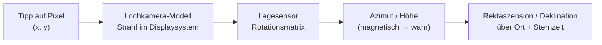

# StarWindow

Android-App (Kotlin / Jetpack Compose), mit der man mit der Handykamera einen **Himmelsausschnitt
einzeichnet** – ein „Fenster“ zwischen Dächern, Bäumen oder Bergen – und diesen Ausschnitt exakt in
Himmelskoordinaten festhält. Aus diesem Fenster lässt sich anschließend berechnen, **welche
Objekte im Lauf der Nacht hindurchziehen und wie lange** sie darin sichtbar sind.

Der Stand ist bewusst ein tragfähiger Anfang: Kamera, Kompass, Fenstergeometrie und die
Koordinaten-Zuordnung sind fertig und getestet, der Katalogteil läuft mit einem mitgelieferten
Basiskatalog und ist für Online-Kataloge vorbereitet.

---

## In Android Studio öffnen

1. Repository klonen, in Android Studio über **File → Open** das Projektverzeichnis wählen.
2. Android Studio legt `local.properties` mit dem SDK-Pfad automatisch an.
3. Gradle-Sync abwarten, dann `app` auf einem **echten Gerät** starten – Emulatoren haben weder
   brauchbaren Kompass noch Kamera für den Himmel.

Anforderungen: Android Studio Ladybug oder neuer, JDK 17, Android SDK 35, minSdk 26.

```
./gradlew :app:assembleDebug     # APK bauen
./gradlew :app:testDebugUnitTest # 104 Unit-Tests
```

---

## Wie die Zuordnung zum Himmel funktioniert

Das ist der Kern der App. Ein Fingertipp auf den Bildschirm wird über vier Schritte zu einer
Himmelsrichtung:



1. **Lochkamera-Modell** – Aus `CameraCharacteristics` (Brennweite und physische Sensorgröße)
   ergibt sich das Bildfeld, daraus die Brennweite in Bildschirmpixeln. Der Vorschaustrom wird mit
   `FIT_CENTER` angezeigt, nicht mit `FILL_CENTER`: der Beschnitt von `FILL_CENTER` hängt vom
   Seitenverhältnis des Geräts ab und wäre ein direkter Fehler im Grad-pro-Pixel-Maßstab.
2. **Lage des Geräts** – Der fusionierte `TYPE_ROTATION_VECTOR` liefert eine Rotationsmatrix, die
   für die aktuelle Displaydrehung umgerechnet wird (funktioniert also auch im Querformat) und
   über eine Quaternionen-Glättung läuft, damit die Markierungen nicht zittern.
3. **Wahr statt magnetisch** – Über `GeomagneticField` kommt die Ortsmissweisung dazu; erst danach
   ist der Azimut auf geografisch Nord bezogen.
4. **Himmelskoordinaten** – Mit Breite, Länge und mittlerer Ortssternzeit (GMST nach IAU 1982)
   wird Azimut/Höhe in Rektaszension/Deklination umgerechnet.

Rückwärts läuft dieselbe Kette: Gesetzte Punkte werden als Azimut/Höhe gespeichert und jedes Bild
neu projiziert, nicht als Bildschirmpunkte. Deshalb **bleiben sie beim Schwenken an ihrer Stelle am
Himmel stehen**, statt mit der Kamera mitzuwandern.

### Das Fenster steht fest, der Himmel zieht hindurch

Ein Fenster ist **horizontfest**: an Azimut und Höhe geheftet, wie eine Lücke zwischen zwei
Dächern. Es folgt weder der Kamera noch den Sternen.

* **Schwenkt man die Kamera**, bleibt das Fenster dort am Himmel, wo es gezeichnet wurde, und
  wandert dabei über den Bildschirm – bis aus dem Bild heraus. (Einen Rückweg-Pfeil dorthin gibt es
  noch nicht, siehe [TODO.md](TODO.md).)
* **Wartet man**, dreht sich der Sternhimmel durch das stehende Fenster. Ein Stern, auf den ein
  Punkt gesetzt wurde, ist zehn Minuten später gut zweieinhalb Grad weitergewandert – die
  Markierung nicht. Genau diese Relativbewegung ist es, die die Durchgangsberechnung auswertet.

Im Moment des Schwenkens sind beide nicht zu unterscheiden, und das ist die eingebaute
Sichtprüfung: Wandert eine Markierung beim Schwenken schneller oder langsamer als das Kamerabild,
stimmt das Bildfeld nicht.

### Nachtsicht-Sucher

Bei echter Dunkelheit zeigt die Kameraautomatik fast nichts – man würde das Fenster gegen ein
schwarzes Rechteck zeichnen. Über das Mond-Symbol lässt sich der Sucher auf **Nacht** umschalten:
Belichtungszeit und ISO werden von Hand gesetzt, der Fokus auf unendlich verriegelt (der Autofokus
findet am dunklen Himmel nichts und sucht endlos). Die Regler wirken auf das laufende Bild.

Lange Belichtungszeiten machen die Vorschau träge; Gradnetz und Markierungen bleiben flüssig, weil
sie getrennt gezeichnet werden. Geräte ohne `MANUAL_SENSOR` fallen auf die volle
Belichtungskorrektur zurück – das hilft etwas, reicht für Sterne aber meist nicht.

### Kalibrieren – vier Wege, keiner Pflicht

Die App funktioniert unkalibriert. Jede Methode verkleinert nur eine der beiden Fehlerquellen, und
**drei von vier brauchen keine Sicht auf Sterne** – wichtig, weil genau die Situationen, für die
diese App gedacht ist, den halben Himmel verdecken.

| Methode | korrigiert | freier Himmel nötig? |
|---|---|---|
| **Sternmuster** – nacheinander vorgeschlagene Sterne mit dem Fadenkreuz anpeilen | Ausrichtung; ab zwei weit auseinanderliegenden Sternen auch die Neigung | ja |
| **Peilung** – einen Punkt bekannter Richtung anpeilen und die Peilung eintragen | Nordrichtung | nein |
| **Schwenk** – ein beliebiges Merkmal antippen, schwenken, erneut antippen | Bildfeld | nein |
| **Manuell** – Regler nach Augenmaß | Bildfeld | nein |

Der Schwenk ist der Grund, warum es ohne Sterne geht: Er wertet nur die *relative* Drehung zwischen
zwei Antippungen aus. Die misst das Gyroskop zuverlässig – ohne Magnetfeld, ohne Nordrichtung, bei
jedem Wetter und auch am Tag im Zimmer.

Die Ausrichtungsmethoden peilen mit dem **Fadenkreuz**, also in der Bildmitte, wo das Bildfeld
rechnerisch keine Rolle spielt. Dadurch verrechnen sich die beiden Kalibrierungen nie gegenseitig.

---

## Fenster zeichnen

Drei Modi, jeweils per Antippen im Sucher:

| Modus | Punkte | Ergebnis |
|---|---|---|
| **Polygon** | ab 3 | freie Kontur, auch konkav (z. B. eine Dachlücke) |
| **Kreis** | 2 | 1. Tipp Mittelpunkt, 2. Tipp Rand |
| **Rechteck** | 2 | in Azimut/Höhe ausgerichteter Kasten |

Fenster werden **in Azimut/Höhe** gespeichert, also fest gegenüber dem Horizont. Genau das ist die
physikalisch richtige Beschreibung einer Lücke zwischen zwei Häusern – der Himmel dreht sich
hindurch, und darauf beruht die Durchgangsberechnung.

Zusätzlich zeigt die Detailansicht, wo die Fenstermitte zum Aufnahmezeitpunkt und jetzt am
Sternhimmel steht (RA/Dec), zusammen mit Ort, Missweisung und Kompassgüte.

---

## Nachschauen, was durchzieht

Die Detailansicht eines Fensters beantwortet drei Fragen auf einmal:

* **Was** zieht durch – gefiltert nach Sternbildern, Sternen, Nebeln, Galaxien oder Sternhaufen.
* **Wann** – Eintritt, Austritt, Dauer und der Zeitpunkt der größten Höhe, jeweils auf die Sekunde
  eingeschachtelt.
* **Wie die Laufbahn verläuft** – die Fensteransicht oben zeichnet das stehende Fenster und die
  Bahnen, die hindurchziehen. Durchgezogen ist die Zeit im Fenster, gepunktet der An- und Abflug,
  Punkte markieren volle Stunden, ein Pfeil zeigt die Richtung. Eine Zeile antippen hebt ihre Bahn
  hervor.

Die Darstellung nutzt die Tangentialebene der Fenstermitte. Ein einfaches Azimut/Höhe-Diagramm
würde sowohl die Form des Fensters als auch die Krümmung der Bahnen verzerren – weit oben am Himmel
sehr deutlich.

### Sternbilder

Mitgeliefert sind 29 Sternbildfiguren mit 203 Figursternen. Bewusst die **Figuren**, nicht die
amtlichen IAU-Flächen: Ein Fenster von wenigen Grad enthält so gut wie nie eine ganze
Sternbildfläche, wohl aber Orions Gürtel. Deshalb gilt ein Sternbild als durchziehend, solange
mindestens ein Figurstern im Fenster steht, und zu jedem Durchgang steht dabei, wie viel der Figur
gleichzeitig zu sehen war („höchstens 5 von 7 Figursternen"). Bei ausgewähltem Sternbild zeichnet
die Fensteransicht die Figur zum günstigsten Zeitpunkt mit ein.

## Durchgangsberechnung

`TransitCalculator` tastet den gewünschten Zeitraum in 60-Sekunden-Schritten ab, prüft für jedes
Katalogobjekt die Zugehörigkeit zum Fenster und schachtelt jeden Ein- und Austritt per Bisektion
auf unter eine Sekunde ein. Abtasten statt analytisch lösen, weil das Fenster ein beliebiges
Polygon sein darf – dafür gibt es keine geschlossene Lösung.

* Objekte, deren Deklination von diesem Breitengrad aus die Höhe des Fensters nie erreicht, werden
  vorab aussortiert.
* Die Positionen enthalten atmosphärische Refraktion (Bennett), passend dazu, dass das Fenster
  anhand des Kamerabildes gezeichnet wurde.
* Ergebnis pro Objekt: Eintritt, Austritt, Dauer, höchste erreichte Höhe.

---

## Kataloge

Mitgeliefert ist `app/src/main/assets/catalog/starwindow_core.json` mit 115 Objekten (helle Sterne,
Messier-Auswahl, einige NGC/IC-Objekte, J2000). Das reicht, um die ganze Kette zu benutzen und zu
prüfen, ohne Netz.

Der Ausbau geht **lokal**, nicht online: der vollständige NGC/IC-Katalog (13.970 Objekte) wiegt auf
die benötigten Felder reduziert 228 KB gepackt, das ganze Sternenfeld des bloßen Auges rund 140 KB.
Speicherplatz ist also kein Argument für einen Online-Katalog, Verfügbarkeit im Dunkeln aber ein
starkes dagegen. Warum insbesondere Gaia dafür der falsche Katalog ist, steht in
[DEV_PLAN.md](DEV_PLAN.md).

Für Online-Kataloge steht das Interface `CatalogSource` trotzdem bereit; `RemoteCatalogSource` ist
ein bewusst leerer Platzhalter mit der geplanten VizieR/SIMBAD-TAP-Abfrage im Kommentar – gedacht
als Ergänzung für ungewöhnlich tiefe Suchen, nicht als Ersatz.

---

## Projektaufbau

```
app/src/main/java/com/starwindow/app/
├── core/
│   ├── astro/       Zeit, Koordinaten, Transformationen  (reine Mathematik, testbar)
│   ├── geometry/    Kugelgeometrie, Fensterformen
│   ├── camera/      Kameraoptik, Bildschirm ⇄ Himmel
│   └── sensors/     Lage- und Standortverfolgung
├── data/
│   ├── catalog/     Katalogquellen und -modell
│   └── windows/     Persistenz (JSON) und Einstellungen
├── domain/          Durchgangsberechnung
└── ui/              Compose-Oberfläche (Kamera, Liste, Detail)
```

`core/` hat bis auf die Sensorschicht keine Android-Abhängigkeiten – deswegen laufen die Tests als
normale JVM-Unit-Tests ohne Emulator.

Bewusste Entscheidungen: kein Dependency-Injection-Framework (`AppContainer` reicht bei dieser
Größe), keine Play Services (`LocationManager` genügt für eine Genauigkeit von einigen hundert
Metern), keine Datenbank (Fenster liegen als eine JSON-Datei, damit sie exportierbar bleiben).
Jede dieser Stellen ist eine einzelne Naht, die sich später austauschen lässt.

---

## Tests

104 Unit-Tests in `app/src/test/`, alle grün. Sie prüfen nicht nur, dass Funktionen etwas
zurückgeben, sondern physikalische Invarianten:

* GMST zur Epoche J2000 gegen die IAU-Konstante, siderischer Tag gegen Sonnentag,
* Zenit ↔ Deklination = Breitengrad, Himmelspol steht genau im Norden auf Breitengradhöhe,
* Winkelabstände bleiben bei der Transformation erhalten (sie ist eine Drehung),
* Kulminationshöhe von Wega über Berlin,
* Bildschirm ⇄ Himmel als exakte Umkehrung, Schwenken um 10° verschiebt um genau die
  entsprechende Pixelzahl,
* Rechteckfenster über die 0°-Naht hinweg, konkave Polygone,
* ein zirkumpolares Objekt kehrt nach genau einem siderischen Tag ins Fenster zurück,
* der Ausgleich einer bekannten Sensorabweichung liefert genau deren Umkehrung zurück, auch bei
  Rauschen und bei reinen Kippfehlern,
* der Schwenk-Löser findet ein simuliertes Bildfeld auf ein Promille genau wieder – und lehnt zu
  kurze Schwenke und unterschiedliche Merkmale ab, statt zu raten,
* gespeicherte Fenster überstehen den JSON-Umlauf, Basiskatalog und Sternbildfiguren werden gegen
  veröffentlichte J2000-Positionen geprüft – und kein Figurabschnitt darf unplausibel lang sein,
  was einen Tippfehler in einer der 203 Koordinaten sofort auffliegen lässt.

---

## Was als Nächstes ansteht

Die vollständige, nach Dringlichkeit sortierte Liste steht in **[TODO.md](TODO.md)**. Das Wichtigste
daraus:

* **Zuerst:** Projekt in Android Studio kompilieren – die UI-Schicht wurde ohne Zugriff auf Google
  Maven gebaut und ist noch von keinem Compiler gesehen worden. Danach Feldabgleich an einem
  bekannten Stern; das ist der eigentliche Abnahmetest.
* Nachtsicht und Kalibrierung sind gebaut, aber noch auf keiner echten Kamera gelaufen – die
  erreichbaren Belichtungszeiten und die Schwenkmethode gehören als Erstes aufs Gerät.
* Bildstapelung, damit auch schwächere Sterne im Sucher erscheinen.
* Mond, Sonne und Planeten sowie die Anbindung der Online-Kataloge.
