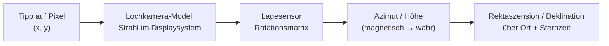

# StarWindow

Android-App (Kotlin / Jetpack Compose), mit der man mit der Handykamera einen **Himmelsausschnitt
einzeichnet** – ein „Fenster“ zwischen Dächern, Bäumen oder Bergen – und diesen Ausschnitt exakt in
Himmelskoordinaten festhält. Aus diesem Fenster lässt sich anschließend berechnen, **welche
Objekte im Lauf der Nacht hindurchziehen und wie lange** sie darin sichtbar sind.

Der Stand ist bewusst ein tragfähiger Anfang: Kamera, Kompass, Fenstergeometrie und die
Koordinaten-Zuordnung sind fertig und getestet, der Katalogteil läuft mit einem mitgelieferten
Basiskatalog und ist für Online-Kataloge vorbereitet.

---

## In Android Studio öffnen

1. Repository klonen, in Android Studio über **File → Open** das Projektverzeichnis wählen.
2. Android Studio legt `local.properties` mit dem SDK-Pfad automatisch an.
3. Gradle-Sync abwarten, dann `app` auf einem **echten Gerät** starten – Emulatoren haben weder
   brauchbaren Kompass noch Kamera für den Himmel.

Anforderungen: Android Studio Ladybug oder neuer, JDK 17, Android SDK 35, minSdk 26.

```
./gradlew :app:assembleDebug     # APK bauen
./gradlew :app:testDebugUnitTest # 177 Unit-Tests
```

---

## Wie die Zuordnung zum Himmel funktioniert

Das ist der Kern der App. Ein Fingertipp auf den Bildschirm wird über vier Schritte zu einer
Himmelsrichtung:



1. **Lochkamera-Modell** – Aus `CameraCharacteristics` (Brennweite und physische Sensorgröße)
   ergibt sich das Bildfeld, daraus die Brennweite in Bildschirmpixeln. Der Vorschaustrom wird mit
   `FIT_CENTER` angezeigt, nicht mit `FILL_CENTER`: der Beschnitt von `FILL_CENTER` hängt vom
   Seitenverhältnis des Geräts ab und wäre ein direkter Fehler im Grad-pro-Pixel-Maßstab.
2. **Lage des Geräts** – Kreisel und Beschleunigungsmesser (`TYPE_GAME_ROTATION_VECTOR`) tragen die
   Ausrichtung, der Kompass steuert nur die Nordrichtung bei; siehe
   [Ruhig und richtig zeigen](#ruhig-und-richtig-zeigen). Die Matrix wird für die aktuelle
   Displaydrehung umgerechnet (funktioniert also auch im Querformat) und läuft über eine
   Quaternionen-Glättung mit adaptiver Zeitkonstante.
3. **Wahr statt magnetisch** – Über `GeomagneticField` kommt die Ortsmissweisung dazu; erst danach
   ist der Azimut auf geografisch Nord bezogen.
4. **Himmelskoordinaten** – Mit Breite, Länge und mittlerer Ortssternzeit (GMST nach IAU 1982)
   wird Azimut/Höhe in Rektaszension/Deklination umgerechnet, und die **Präzession** verbindet die
   J2000-Kataloge mit dem heutigen Himmel.

Rückwärts läuft dieselbe Kette: Gesetzte Punkte werden als Azimut/Höhe gespeichert und jedes Bild
neu projiziert, nicht als Bildschirmpunkte. Deshalb **bleiben sie beim Schwenken an ihrer Stelle am
Himmel stehen**, statt mit der Kamera mitzuwandern.

### Das Fenster steht fest, der Himmel zieht hindurch

Ein Fenster ist **horizontfest**: an Azimut und Höhe geheftet, wie eine Lücke zwischen zwei
Dächern. Es folgt weder der Kamera noch den Sternen.

* **Schwenkt man die Kamera**, bleibt das Fenster dort am Himmel, wo es gezeichnet wurde, und
  wandert dabei über den Bildschirm – bis aus dem Bild heraus. (Für ein *Objekt* gibt es den
  Rückweg-Pfeil, siehe unten; für ein gespeichertes Fenster noch nicht, siehe [TODO.md](TODO.md).)
* **Wartet man**, dreht sich der Sternhimmel durch das stehende Fenster. Ein Stern, auf den ein
  Punkt gesetzt wurde, ist zehn Minuten später gut zweieinhalb Grad weitergewandert – die
  Markierung nicht. Genau diese Relativbewegung ist es, die die Durchgangsberechnung auswertet.

Im Moment des Schwenkens sind beide nicht zu unterscheiden, und das ist die eingebaute
Sichtprüfung: Wandert eine Markierung beim Schwenken schneller oder langsamer als das Kamerabild,
stimmt das Bildfeld nicht.

### Nachtsicht-Sucher

Bei echter Dunkelheit zeigt die Kameraautomatik fast nichts – man würde das Fenster gegen ein
schwarzes Rechteck zeichnen. Über das Mond-Symbol lässt sich der Sucher auf **Nacht** umschalten:
Belichtungszeit und ISO werden von Hand gesetzt, der Fokus auf unendlich verriegelt (der Autofokus
findet am dunklen Himmel nichts und sucht endlos). Die Regler wirken auf das laufende Bild.

Lange Belichtungszeiten machen die Vorschau träge; Gradnetz und Markierungen bleiben flüssig, weil
sie getrennt gezeichnet werden. Geräte ohne `MANUAL_SENSOR` fallen auf die volle
Belichtungskorrektur zurück – das hilft etwas, reicht für Sterne aber meist nicht.

### Ruhig und richtig zeigen

Zwei Fehler entscheiden darüber, ob eine Markierung auf dem Stern sitzt oder daneben. Beide sind
größer als das, was die Kamera auflöst, und beide werden hier behandelt.

**Der Sensor zittert.** Der naheliegende `TYPE_ROTATION_VECTOR` mischt den Magnetsensor in *jede*
Probe. Das erkauft eine absolute Nordrichtung – und bezahlt sie mit dem Rauschen des Magnetsensors
auf allen drei Achsen, in voller Rate, dauerhaft. Eine Markierung wandert dann um ein bis zwei Grad,
und wer an einem Auto vorbeigeht, sieht den ganzen Himmel ruckeln.

Deshalb trägt hier `TYPE_GAME_ROTATION_VECTOR` die Lage – Kreisel und Beschleunigungsmesser, **ohne**
Magnetsensor. Über Sekunden und Minuten, also genau über die Zeitspanne, in der man eine Kamera
ausrichtet, ist er um eine Größenordnung ruhiger. Der Kompass wird nur noch für **eine einzige Zahl**
befragt: den Winkel zwischen dieser Kreiselwelt und echtem Norden. Diese Zahl läuft durch einen
Filter mit zehn Sekunden Zeitkonstante und wird nur nachgeführt, wenn drei Bedingungen stimmen –
Android meldet den Magnetsensor als brauchbar, die gemessene Feldstärke passt zum Erdmagnetfeld am
eigenen Ort (`GeomagneticField`), und das Handy schwenkt gerade nicht. Fällt eine davon weg, hält der
Kreisel die Nordrichtung weiter, und der Sucher zeigt „Nord gehalten" statt den Himmel zu verreißen.
Genau das ist das richtige Verhalten: **eine langsam alternde Richtung ist brauchbar, eine springende
nicht.**

Die Glättung selbst läuft über eine **Zeitkonstante** statt über ein festes Gewicht pro Probe. Geräte
liefern zwischen 30 und 200 Proben pro Sekunde; mit festem Gewicht glättet derselbe Code auf dem
einen Handy sechsmal stärker als auf dem anderen. Und die Zeitkonstante passt sich an: ruhig
gehalten wird kräftig geglättet (0,30 s, das Zittern verschwindet), beim Schwenken fast gar nicht
(0,02 s, die Markierungen laufen nicht hinter dem Kamerabild her).

**Der Katalog ist von gestern.** Alle Katalogpositionen stehen in **J2000**, der Himmel aber nicht:
Die Erdachse taumelt, und das ganze Äquatorgitter hat sich seither um rund **50,3 Bogensekunden pro
Jahr** gedreht – Mitte der 2020er also um etwa **0,37°**, zwei Drittel Vollmonddurchmesser und sechs
bis sieben Pixel im Sucher. Solange die App mehrere Grad danebenlag, war das vernachlässigbar. Bei
kalibriertem Kompass ist es das nicht mehr, und es ist dort sogar schädlich: Die Sternkalibrierung
peilt eine *Katalogposition* an, also wäre die Präzession nicht bloß ein Versatz in der Anzeige –
sie würde als Kompassfehler eingemessen und danach auf jede Richtung angewendet, die die App meldet.

`Precession` rechnet deshalb mit der IAU-2006-Reihe (P03, dieselbe Familie, die auch Stellarium
benutzt) von J2000 auf heute um, als Drehung von Richtungsvektoren, damit sie umkehrbar und als
Drehung prüfbar bleibt. Nicht enthalten, weil auf einem Handy Rauschen: Nutation (≤ 9″), jährliche
Aberration (≤ 20,5″) und Eigenbewegung – zusammen unter einem Hundertstelgrad. Die
**Refraktion** dagegen ist mit bis zu 0,57° am Horizont alles andere als vernachlässigbar und wird
nach Bennett gerechnet – gerade für diese App wichtig, deren Fenster meistens tief stehen.

| Fehlerquelle | Größenordnung | Stand |
|---|---|---|
| Kompass unkalibriert | 5–15° | Kalibrierung, vier Wege |
| Magnetstörung (Auto, Heizung, Lautsprecher) | 5–40° | erkannt, Nordrichtung wird gehalten |
| Sensorzittern | 1–2° | Kreiselfusion + adaptive Glättung |
| Präzession seit J2000 | 0,37° (2026) | gerechnet |
| Refraktion am Horizont | bis 0,57° | gerechnet (Bennett) |
| Bildfeld der Kamera | 1–5 % | Kalibrierung per Schwenk |
| Nutation, Aberration, Eigenbewegung | < 0,01° | bewusst weggelassen |

### Kalibrieren – vier Wege, keiner Pflicht

Die App funktioniert unkalibriert. Jede Methode verkleinert nur eine der beiden Fehlerquellen, und
**drei von vier brauchen keine Sicht auf Sterne** – wichtig, weil genau die Situationen, für die
diese App gedacht ist, den halben Himmel verdecken.

| Methode | korrigiert | freier Himmel nötig? |
|---|---|---|
| **Sternmuster** – nacheinander vorgeschlagene Sterne mit dem Fadenkreuz anpeilen | Ausrichtung; ab zwei weit auseinanderliegenden Sternen auch die Neigung | ja |
| **Peilung** – einen Punkt bekannter Richtung anpeilen und die Peilung eintragen | Nordrichtung | nein |
| **Schwenk** – ein beliebiges Merkmal antippen, schwenken, erneut antippen | Bildfeld | nein |
| **Manuell** – Regler nach Augenmaß | Bildfeld | nein |

Der Schwenk ist der Grund, warum es ohne Sterne geht: Er wertet nur die *relative* Drehung zwischen
zwei Antippungen aus. Die misst das Gyroskop zuverlässig – ohne Magnetfeld, ohne Nordrichtung, bei
jedem Wetter und auch am Tag im Zimmer.

Die Ausrichtungsmethoden peilen mit dem **Fadenkreuz**, also in der Bildmitte, wo das Bildfeld
rechnerisch keine Rolle spielt. Dadurch verrechnen sich die beiden Kalibrierungen nie gegenseitig.

---

## Ein Objekt suchen und im Sucher wiederfinden

Oben in der Kameraansicht steht ein Suchfeld. Es öffnet einen eigenen Bildschirm mit der ganzen
Kette **suchen → anschauen → hinfinden**:

1. **Suchen** – nach Namen (`Orionnebel`, `Plejaden`, `pferdekopf`) oder nach Katalognummer. Die
   Schreibweise ist gleichgültig: `M45`, `M 45` und `mel022` finden alle die Plejaden, weil jede
   Bezeichnung vor dem Vergleich auf Kleinbuchstaben ohne Leer- und Bindestriche gefaltet wird.
   Treffer werden **bewertet, nicht nur gefiltert**: eine exakte Bezeichnung schlägt einen Namen,
   ein Name schlägt einen Wortanfang, ein Wortanfang schlägt einen Treffer mitten im Wort, und bei
   Gleichstand gewinnt das hellere Objekt. `M31` bringt deshalb die Andromedagalaxie nach vorn und
   nicht `NGC 3184`, das die Zeichenfolge zufällig in einer Nebenbezeichnung trägt.

   Solange nichts eingegeben ist, zeigt die Liste **was gerade hoch am Himmel steht** – der
   Bildschirm ist nie leer, und das beantwortet die Frage „was soll ich heute Nacht überhaupt
   anschauen".

2. **Anschauen** – ein Tipp auf eine Zeile öffnet dasselbe Info-Blatt wie das Info-Symbol in der
   Fensteransicht: Bild, Höhenverlauf über die nächsten 24 Stunden, Helligkeit, Flächenhelligkeit,
   Ausdehnung, Koordinaten und die weiteren Bezeichnungen.

3. **Hinfinden** – der Knopf **Track** unten führt zurück in die Kameraansicht und zeigt dort auf
   das Objekt. Steht es im Bild, bekommt es einen Ring mit Namen und Winkelabstand. Steht es
   außerhalb, sitzt ein Pfeil am Bildschirmrand, der die Richtung zum Drehen angibt, zusammen mit
   dem Winkel, der noch fehlt. Der Pfeil funktioniert auch, wenn das Objekt **hinter dem Rücken**
   steht – dort liefert die Lochkamera-Projektion keine brauchbare Antwort mehr, deshalb nimmt
   `TargetIndicator` die Richtung aus dem Vektor des Ziels im Displaysystem statt aus einem
   projizierten Punkt. Die Balken oben und unten werden dabei ausgemessen und ausgespart, damit der
   Pfeil nie hinter den Bedienelementen landet.

Eine Leiste unten nennt Name, Azimut und Höhe des verfolgten Objekts – und sagt ausdrücklich, wenn
es unter dem Horizont steht. Das ist der Unterschied zwischen „weiterdrehen" und „in vier Stunden
wiederkommen", und der Pfeil allein kann ihn nicht ausdrücken.

### Objekte auf einen Blick

Listen und Sucher benutzen dieselbe Bildsprache, damit eine Zeile und eine Markierung am Himmel
ohne Lesen zusammenfinden:

* **Kartensymbole** statt Typbezeichnungen – ausgefüllter Punkt für einen Stern, Ellipse für eine
  Galaxie, gestrichelter Kreis für einen offenen Sternhaufen, Kreis mit Kreuz für einen
  Kugelsternhaufen, Quadrat für einen Nebel. Das sind die Symbole gedruckter Sternkarten, nicht
  eigens erfundene Icons.
* **Eine Farbe je Art**, in der Liste wie auf den Markierungen über dem Kamerabild – Wasserstoffrot
  für Emissionsnebel, Staubblau für Reflexionsnebel, Violett für Galaxien.
* **Die Höhe jetzt** rechts in jeder Zeile, farbig danach, ob das Objekt hoch genug für eine
  Aufnahme steht, tief im Dunst hängt oder unter dem Horizont ist. Die Farbe wiederholt die Zahl,
  sie ersetzt sie nicht – das bleibt auch für ein farbenblindes Auge lesbar.

---

## Fenster zeichnen

Drei Modi, jeweils per Antippen im Sucher:

| Modus | Punkte | Ergebnis |
|---|---|---|
| **Polygon** | ab 3 | freie Kontur, auch konkav (z. B. eine Dachlücke) |
| **Kreis** | 2 | 1. Tipp Mittelpunkt, 2. Tipp Rand |
| **Rechteck** | 2 | in Azimut/Höhe ausgerichteter Kasten |

Fenster werden **in Azimut/Höhe** gespeichert, also fest gegenüber dem Horizont. Genau das ist die
physikalisch richtige Beschreibung einer Lücke zwischen zwei Häusern – der Himmel dreht sich
hindurch, und darauf beruht die Durchgangsberechnung.

Zusätzlich zeigt die Detailansicht, wo die Fenstermitte zum Aufnahmezeitpunkt und jetzt am
Sternhimmel steht (RA/Dec), zusammen mit Ort, Missweisung und Kompassgüte.

---

## Nachschauen, was durchzieht

Die Detailansicht eines Fensters beantwortet drei Fragen auf einmal:

* **Was** zieht durch – gefiltert nach Sternbildern, Sternen, Nebeln, Galaxien oder Sternhaufen.
* **Wann** – Eintritt, Austritt, Dauer und der Zeitpunkt der größten Höhe, jeweils auf die Sekunde
  eingeschachtelt.
* **Wie die Laufbahn verläuft** – die Fensteransicht oben zeichnet das stehende Fenster und die
  Bahnen, die hindurchziehen. Durchgezogen ist die Zeit im Fenster, gepunktet der An- und Abflug,
  Punkte markieren volle Stunden, ein Pfeil zeigt die Richtung. Eine Zeile antippen hebt ihre Bahn
  hervor.

### Das Info-Symbol an jedem Objekt

Öffnet ein Blatt mit allem, was zu dem Objekt bekannt ist:

* **Ein Bild des Ausschnitts**, gerendert aus dem DSS2-Himmelsdurchmusterung über hips2fits (CDS
  Straßburg) – auf die Koordinaten des Objekts gerahmt, also genau der Ausschnitt, den auch das
  Fenster zeigt. Ohne Verbindung bleibt das Feld leer; alles andere im Blatt funktioniert weiter.
* **Höhenverlauf über die Zeit**: wann das Objekt wie hoch steht, mit den Uhrzeiten unten am
  Graphen, dem Horizont als Schwelle, grün hinterlegten Zeiten im Fenster und einer Marke für
  „jetzt“.
* **Zahlen für die Aufnahme**: Flächenhelligkeit (sagt mehr als die Gesamthelligkeit – ein großes
  Objekt verteilt sein Licht), Ausdehnung, Positionswinkel, Morphologie, Katalogbezeichnungen, und
  ob das Objekt überhaupt ins Fenster passt.

Die Darstellung nutzt die Tangentialebene der Fenstermitte. Ein einfaches Azimut/Höhe-Diagramm
würde sowohl die Form des Fensters als auch die Krümmung der Bahnen verzerren – weit oben am Himmel
sehr deutlich.

### Sternbilder

Mitgeliefert sind 29 Sternbildfiguren mit 203 Figursternen. Bewusst die **Figuren**, nicht die
amtlichen IAU-Flächen: Ein Fenster von wenigen Grad enthält so gut wie nie eine ganze
Sternbildfläche, wohl aber Orions Gürtel. Deshalb gilt ein Sternbild als durchziehend, solange
mindestens ein Figurstern im Fenster steht, und zu jedem Durchgang steht dabei, wie viel der Figur
gleichzeitig zu sehen war („höchstens 5 von 7 Figursternen"). Bei ausgewähltem Sternbild zeichnet
die Fensteransicht die Figur zum günstigsten Zeitpunkt mit ein.

## Durchgangsberechnung

`TransitCalculator` tastet den gewünschten Zeitraum in 60-Sekunden-Schritten ab, prüft für jedes
Katalogobjekt die Zugehörigkeit zum Fenster und schachtelt jeden Ein- und Austritt per Bisektion
auf unter eine Sekunde ein. Abtasten statt analytisch lösen, weil das Fenster ein beliebiges
Polygon sein darf – dafür gibt es keine geschlossene Lösung.

* Objekte, deren Deklination von diesem Breitengrad aus die Höhe des Fensters nie erreicht, werden
  vorab aussortiert.
* Die Positionen enthalten atmosphärische Refraktion (Bennett), passend dazu, dass das Fenster
  anhand des Kamerabildes gezeichnet wurde.
* Ergebnis pro Objekt: Eintritt, Austritt, Dauer, höchste erreichte Höhe.

---

## Kataloge

Alles liegt lokal, zusammen **184 KB gepackt**:

| Datei | Inhalt | gepackt |
|---|---|---:|
| `starwindow_core.json` | 57 helle Sterne, deutsche Namen | 2 KB |
| `deepsky.json` | 3.241 Deep-Sky-Objekte aus OpenNGC | 179 KB |
| `constellations.json` | 29 Sternbildfiguren, 203 Figursterne | 4 KB |

Die Deep-Sky-Auswahl zielt auf **Astrofotografie**, nicht auf Vollständigkeit: aufgenommen wird,
was einen Eigennamen trägt, im Messier-Katalog steht, heller als 13 mag oder größer als 5′ ist.
Groß und lichtschwach ist dabei ausdrücklich erwünscht – Kalifornien-, Rosetten- oder Herznebel
stehen in keiner visuellen Liste, sind aber Standardziele. Die übrigen rund 9.000 namenlosen
15-mag-Galaxien bleiben draußen; sie würden jede Ergebnisliste unbrauchbar machen, ohne je ein
Ziel zu sein.

Zu jedem Objekt kommen die Angaben, die beim Fotografieren zählen: Flächenhelligkeit, große und
kleine Achse, Positionswinkel, Morphologie und sämtliche Katalogbezeichnungen.

Erzeugt wird `deepsky.json` reproduzierbar mit `scripts/import_openngc.py`; die deutschen Namen
liegen daneben in `scripts/german_names.json`, damit sie einen Neuimport überstehen.
Quelle: [OpenNGC](https://github.com/mattiaverga/OpenNGC) von Mattia Verga, CC-BY-SA-4.0.

Der Ausbau geht **lokal**, nicht online: der vollständige NGC/IC-Katalog (13.970 Objekte) wiegt auf
die benötigten Felder reduziert 228 KB gepackt, das ganze Sternenfeld des bloßen Auges rund 140 KB.
Speicherplatz ist also kein Argument für einen Online-Katalog, Verfügbarkeit im Dunkeln aber ein
starkes dagegen. Warum insbesondere Gaia dafür der falsche Katalog ist, steht in
[DEV_PLAN.md](DEV_PLAN.md).

Für Online-Kataloge steht das Interface `CatalogSource` trotzdem bereit; `RemoteCatalogSource` ist
ein bewusst leerer Platzhalter mit der geplanten VizieR/SIMBAD-TAP-Abfrage im Kommentar – gedacht
als Ergänzung für ungewöhnlich tiefe Suchen, nicht als Ersatz.

---

## Projektaufbau

```
app/src/main/java/com/starwindow/app/
├── core/
│   ├── astro/       Zeit, Koordinaten, Transformationen  (reine Mathematik, testbar)
│   ├── geometry/    Kugelgeometrie, Fensterformen
│   ├── camera/      Kameraoptik, Bildschirm ⇄ Himmel
│   └── sensors/     Lage- und Standortverfolgung
├── data/
│   ├── catalog/     Katalogquellen und -modell
│   ├── tracking/    Das verfolgte Objekt, über Neustarts hinweg
│   └── windows/     Persistenz (JSON) und Einstellungen
├── domain/          Durchgangsberechnung, Katalogsuche
└── ui/              Compose-Oberfläche (Kamera, Suche, Liste, Detail)
```

`core/` hat bis auf die Sensorschicht keine Android-Abhängigkeiten – deswegen laufen die Tests als
normale JVM-Unit-Tests ohne Emulator.

Bewusste Entscheidungen: kein Dependency-Injection-Framework (`AppContainer` reicht bei dieser
Größe), keine Play Services (`LocationManager` genügt für eine Genauigkeit von einigen hundert
Metern), keine Datenbank (Fenster liegen als eine JSON-Datei, damit sie exportierbar bleiben).
Jede dieser Stellen ist eine einzelne Naht, die sich später austauschen lässt.

---

## Tests

177 Unit-Tests in `app/src/test/`, alle grün. Sie prüfen nicht nur, dass Funktionen etwas
zurückgeben, sondern physikalische Invarianten:

* GMST zur Epoche J2000 gegen die IAU-Konstante, siderischer Tag gegen Sonnentag,
* Zenit ↔ Deklination = Breitengrad, Himmelspol steht genau im Norden auf Breitengradhöhe,
* Winkelabstände bleiben bei der Transformation erhalten (sie ist eine Drehung),
* Kulminationshöhe von Wega über Berlin,
* Bildschirm ⇄ Himmel als exakte Umkehrung, Schwenken um 10° verschiebt um genau die
  entsprechende Pixelzahl,
* Rechteckfenster über die 0°-Naht hinweg, konkave Polygone,
* ein zirkumpolares Objekt kehrt nach genau einem siderischen Tag ins Fenster zurück,
* der Ausgleich einer bekannten Sensorabweichung liefert genau deren Umkehrung zurück, auch bei
  Rauschen und bei reinen Kippfehlern,
* der Schwenk-Löser findet ein simuliertes Bildfeld auf ein Promille genau wieder – und lehnt zu
  kurze Schwenke und unterschiedliche Merkmale ab, statt zu raten,
* die Präzession dreht die Ekliptiklänge um die lehrbuchmäßigen 50,3″ pro Jahr weiter, lässt die
  Ekliptikbreite in Ruhe, erhält Winkelabstände zwischen Sternen (sie ist eine Drehung), lässt den
  Ekliptikpol nahezu stehen und schiebt Polaris in die richtige Richtung – und ein Wächtertest merkt
  es, falls eine Aufrufstelle wieder rohe J2000-Koordinaten in die Horizontrechnung gibt,
* die Glättung landet nach derselben Zeit am selben Punkt, ob das Gerät 30 oder 200 Proben je
  Sekunde liefert, der Heading-Filter bleibt bei ±2° Kompassrauschen unter einem halben Grad, und
  ein einzelner 40°-Ausreißer bewegt ihn um weniger als ein Grad,
* die Suche ordnet `M31` der Andromedagalaxie zu und nicht dem Eintrag, der die Zeichenfolge nur
  zufällig enthält, findet ein Objekt unter jeder seiner Bezeichnungen und antwortet auf Unsinn mit
  nichts statt mit allem,
* der Zielpfeil bleibt über den ganzen abgetasteten Himmel hinweg auf dem Bildschirm und außerhalb
  der Bedienbalken, zeigt bei einem Ziel im Rücken nach oben statt nach unten, und sein
  Winkelabstand stimmt mit dem Winkel zwischen Bildmitte und Ziel überein,
* gespeicherte Fenster überstehen den JSON-Umlauf, Basiskatalog und Sternbildfiguren werden gegen
  veröffentlichte J2000-Positionen geprüft – und kein Figurabschnitt darf unplausibel lang sein,
  was einen Tippfehler in einer der 203 Koordinaten sofort auffliegen lässt.

---

## Was als Nächstes ansteht

Die vollständige, nach Dringlichkeit sortierte Liste steht in **[TODO.md](TODO.md)**. Das Wichtigste
daraus:

* **Zuerst:** Projekt in Android Studio kompilieren – die UI-Schicht wurde ohne Zugriff auf Google
  Maven gebaut und ist noch von keinem Compiler gesehen worden. Danach Feldabgleich an einem
  bekannten Stern; das ist der eigentliche Abnahmetest.
* Nachtsicht und Kalibrierung sind gebaut, aber noch auf keiner echten Kamera gelaufen – die
  erreichbaren Belichtungszeiten und die Schwenkmethode gehören als Erstes aufs Gerät.
* Bildstapelung, damit auch schwächere Sterne im Sucher erscheinen.
* Mond, Sonne und Planeten sowie die Anbindung der Online-Kataloge.
