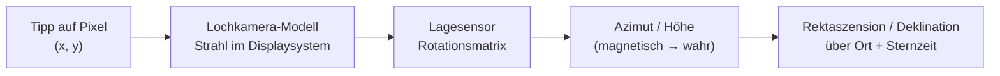

# StarWindow

Android-App (Kotlin / Jetpack Compose), mit der man mit der Handykamera einen **Himmelsausschnitt
einzeichnet** – ein „Fenster“ zwischen Dächern, Bäumen oder Bergen – und diesen Ausschnitt exakt in
Himmelskoordinaten festhält. Aus diesem Fenster lässt sich anschließend berechnen, **welche
Objekte im Lauf der Nacht hindurchziehen und wie lange** sie darin sichtbar sind.

Der Stand ist bewusst ein tragfähiger Anfang: Kamera, Kompass, Fenstergeometrie und die
Koordinaten-Zuordnung sind fertig und getestet, der Katalogteil läuft mit einem mitgelieferten
Basiskatalog und ist für Online-Kataloge vorbereitet. Dazu kommt die zweite Frage jeder
Astrofotografie – **[wird die Nacht überhaupt etwas?](#wetter-für-die-nacht)** – als eigene Ansicht
mit sechs wählbaren Wettermodellen, Dämmerung, Mondphase und Bortle-Stufe.

Beides läuft in den Benachrichtigungen zusammen: Eine Erinnerung an einen geplanten Termin kommt
**immer** an und trägt die Wetterlage nach, sobald eine da ist; und wer sich auf keine Nacht
festlegen will, merkt ein Ziel vor – die App meldet sich dann von selbst, sobald es abends gut steht
**und** die Nacht klar wird.

---

## In Android Studio öffnen

1. Repository klonen, in Android Studio über **File → Open** das Projektverzeichnis wählen.
2. Android Studio legt `local.properties` mit dem SDK-Pfad automatisch an.
3. Gradle-Sync abwarten, dann `app` auf einem **echten Gerät** starten – Emulatoren haben weder
   brauchbaren Kompass noch Kamera für den Himmel.

Anforderungen: Android Studio Ladybug oder neuer, JDK 17, Android SDK 35, minSdk 26.

```
./gradlew :app:assembleDebug     # APK bauen
./gradlew :app:testDebugUnitTest # 410 Unit-Tests
```

---

## Wie die Zuordnung zum Himmel funktioniert

Das ist der Kern der App. Ein Fingertipp auf den Bildschirm wird über vier Schritte zu einer
Himmelsrichtung:



1. **Lochkamera-Modell** – Aus `CameraCharacteristics` (Brennweite und physische Sensorgröße)
   ergibt sich das Bildfeld, daraus die Brennweite in Bildschirmpixeln. Der Vorschaustrom wird mit
   `FIT_CENTER` angezeigt, nicht mit `FILL_CENTER`: der Beschnitt von `FILL_CENTER` hängt vom
   Seitenverhältnis des Geräts ab und wäre ein direkter Fehler im Grad-pro-Pixel-Maßstab.
2. **Lage des Geräts** – Kreisel und Beschleunigungsmesser (`TYPE_GAME_ROTATION_VECTOR`) tragen die
   Ausrichtung, der Kompass steuert nur die Nordrichtung bei; siehe
   [Ruhig und richtig zeigen](#ruhig-und-richtig-zeigen). Die Matrix wird für die aktuelle
   Displaydrehung umgerechnet (funktioniert also auch im Querformat) und läuft über eine
   Quaternionen-Glättung mit adaptiver Zeitkonstante.
3. **Wahr statt magnetisch** – Über `GeomagneticField` kommt die Ortsmissweisung dazu; erst danach
   ist der Azimut auf geografisch Nord bezogen.
4. **Himmelskoordinaten** – Mit Breite, Länge und mittlerer Ortssternzeit (GMST nach IAU 1982)
   wird Azimut/Höhe in Rektaszension/Deklination umgerechnet, und die **Präzession** verbindet die
   J2000-Kataloge mit dem heutigen Himmel.

Rückwärts läuft dieselbe Kette: Gesetzte Punkte werden als Azimut/Höhe gespeichert und jedes Bild
neu projiziert, nicht als Bildschirmpunkte. Deshalb **bleiben sie beim Schwenken an ihrer Stelle am
Himmel stehen**, statt mit der Kamera mitzuwandern.

### Das Fenster steht fest, der Himmel zieht hindurch

Ein Fenster ist **horizontfest**: an Azimut und Höhe geheftet, wie eine Lücke zwischen zwei
Dächern. Es folgt weder der Kamera noch den Sternen.

* **Schwenkt man die Kamera**, bleibt das Fenster dort am Himmel, wo es gezeichnet wurde, und
  wandert dabei über den Bildschirm – bis aus dem Bild heraus. Zurück führt derselbe Pfeil, der auch
  zu einem Objekt führt: das Zielsymbol in der Fensterliste, und im Sucher erscheint die Kontur
  wieder, sobald das Fenster im Bild ist.
* **Wartet man**, dreht sich der Sternhimmel durch das stehende Fenster. Ein Stern, auf den ein
  Punkt gesetzt wurde, ist zehn Minuten später gut zweieinhalb Grad weitergewandert – die
  Markierung nicht. Genau diese Relativbewegung ist es, die die Durchgangsberechnung auswertet.

Im Moment des Schwenkens sind beide nicht zu unterscheiden, und das ist die eingebaute
Sichtprüfung: Wandert eine Markierung beim Schwenken schneller oder langsamer als das Kamerabild,
stimmt das Bildfeld nicht.

### Nachtsicht-Sucher

Bei echter Dunkelheit zeigt die Kameraautomatik fast nichts – man würde das Fenster gegen ein
schwarzes Rechteck zeichnen. Über das Mond-Symbol lässt sich der Sucher auf **Nacht** umschalten:
Belichtungszeit und ISO werden von Hand gesetzt, der Fokus auf unendlich verriegelt (der Autofokus
findet am dunklen Himmel nichts und sucht endlos). Die Regler wirken auf das laufende Bild.

Lange Belichtungszeiten machen die Vorschau träge; Gradnetz und Markierungen bleiben flüssig, weil
sie getrennt gezeichnet werden. Geräte ohne `MANUAL_SENSOR` fallen auf die volle
Belichtungskorrektur zurück – das hilft etwas, reicht für Sterne aber meist nicht.

### Ruhig und richtig zeigen

Zwei Fehler entscheiden darüber, ob eine Markierung auf dem Stern sitzt oder daneben. Beide sind
größer als das, was die Kamera auflöst, und beide werden hier behandelt.

**Der Sensor zittert.** Der naheliegende `TYPE_ROTATION_VECTOR` mischt den Magnetsensor in *jede*
Probe. Das erkauft eine absolute Nordrichtung – und bezahlt sie mit dem Rauschen des Magnetsensors
auf allen drei Achsen, in voller Rate, dauerhaft. Eine Markierung wandert dann um ein bis zwei Grad,
und wer an einem Auto vorbeigeht, sieht den ganzen Himmel ruckeln.

Deshalb trägt hier `TYPE_GAME_ROTATION_VECTOR` die Lage – Kreisel und Beschleunigungsmesser, **ohne**
Magnetsensor. Über Sekunden und Minuten, also genau über die Zeitspanne, in der man eine Kamera
ausrichtet, ist er um eine Größenordnung ruhiger. Der Kompass wird nur noch für **eine einzige Zahl**
befragt: den Winkel zwischen dieser Kreiselwelt und echtem Norden. Diese Zahl läuft durch einen
Filter mit zehn Sekunden Zeitkonstante und wird nur nachgeführt, wenn drei Bedingungen stimmen –
Android meldet den Magnetsensor als brauchbar, das gemessene Feld passt zum Erdmagnetfeld am eigenen
Ort (`GeomagneticField`), und das Handy schwenkt gerade nicht. Fällt eine davon weg, hält der Kreisel
die Nordrichtung weiter, und der Sucher zeigt „Nord gehalten" statt den Himmel zu verreißen. Genau
das ist das richtige Verhalten: **eine langsam alternde Richtung ist brauchbar, eine springende
nicht.**

„Passt zum Erdmagnetfeld" heißt dabei zweierlei, und der zweite Teil ist der wichtigere. Geprüft wird
die **Stärke** – 25 bis 65 µT, je nach Ort, und das Modell weiß auf ein Prozent genau welche – *und*
die **Neigung** der Feldlinien, also der Winkel, unter dem sie in den Boden zeigen (in Mitteleuropa
rund 64°). Der Grund: Eisen in der Nähe addiert einen Vektor zum Erdfeld, und diese Summe kann fast
genauso lang bleiben und trotzdem zwanzig Grad schief zeigen. Eine reine Längenprüfung winkt das
durch – und der Fehler landet ungebremst in der Nordrichtung. Die Neigung hängt nur an der
Schwerkraft und am Feld, nie an der Nordrichtung, und darf deswegen über den Kompass urteilen, ohne
aus ihm abgeleitet zu sein.

Gelesen wird dafür `TYPE_MAGNETIC_FIELD_UNCALIBRATED`: derselbe Sensor liefert zusätzlich die
Hard-Iron-Schätzung der Plattform – die Lautsprecher-, Kamera- und Akkumagnete des Telefons selbst.
Deren Größe trennt zwei Fälle, die der Nutzer völlig verschieden behandeln muss: **„neben dir steht
Eisen"** (ein paar Schritte weggehen) gegen **„der Sensor ist noch nicht eingemessen"** (liegende
Acht schwenken). Vorher hieß beides „unzuverlässig", was auf keines von beidem eine Antwort war.

Und weil der Kreisel driftet, während er Norden trägt, zählt die App die **Haltedauer** mit und
rechnet sie in einen Winkel um: „Nord gehalten (±3°)". Drei Sekunden und zwanzig Minuten sind nicht
dasselbe, und ab dreißig Grad hört die ehrliche Antwort auf, eine Zahl zu sein. Die Driftrate dahinter
ist eine bewusst konservative **Annahme, keine Messung** – sie steht als einzelne Konstante da, damit
ein Feldtest sie ersetzen kann.

Die Glättung selbst läuft über eine **Zeitkonstante** statt über ein festes Gewicht pro Probe. Geräte
liefern zwischen 30 und 200 Proben pro Sekunde; mit festem Gewicht glättet derselbe Code auf dem
einen Handy sechsmal stärker als auf dem anderen. Und die Zeitkonstante passt sich an: ruhig
gehalten wird kräftig geglättet (0,30 s, das Zittern verschwindet), beim Schwenken fast gar nicht
(0,02 s, die Markierungen laufen nicht hinter dem Kamerabild her).

**Der Katalog ist von gestern.** Alle Katalogpositionen stehen in **J2000**, der Himmel aber nicht:
Die Erdachse taumelt, und das ganze Äquatorgitter hat sich seither um rund **50,3 Bogensekunden pro
Jahr** gedreht – Mitte der 2020er also um etwa **0,37°**, zwei Drittel Vollmonddurchmesser und sechs
bis sieben Pixel im Sucher. Solange die App mehrere Grad danebenlag, war das vernachlässigbar. Bei
kalibriertem Kompass ist es das nicht mehr, und es ist dort sogar schädlich: Die Sternkalibrierung
peilt eine *Katalogposition* an, also wäre die Präzession nicht bloß ein Versatz in der Anzeige –
sie würde als Kompassfehler eingemessen und danach auf jede Richtung angewendet, die die App meldet.

`Precession` rechnet deshalb mit der IAU-2006-Reihe (P03, dieselbe Familie, die auch Stellarium
benutzt) von J2000 auf heute um, als Drehung von Richtungsvektoren, damit sie umkehrbar und als
Drehung prüfbar bleibt. Nicht enthalten, weil auf einem Handy Rauschen: Nutation (≤ 9″), jährliche
Aberration (≤ 20,5″) und Eigenbewegung – zusammen unter einem Hundertstelgrad. Die
**Refraktion** dagegen ist mit bis zu 0,57° am Horizont alles andere als vernachlässigbar und wird
nach Bennett gerechnet – gerade für diese App wichtig, deren Fenster meistens tief stehen.

| Fehlerquelle | Größenordnung | Stand |
|---|---|---|
| Kompass unkalibriert | 5–15° | Kalibrierung, vier Wege |
| Magnetstörung (Auto, Heizung, Lautsprecher) | 5–40° | erkannt, Nordrichtung wird gehalten |
| Sensorzittern | 1–2° | Kreiselfusion + adaptive Glättung |
| Präzession seit J2000 | 0,37° (2026) | gerechnet |
| Refraktion am Horizont | bis 0,57° | gerechnet (Bennett) |
| Bildfeld der Kamera | 1–5 % | Kalibrierung per Schwenk |
| Nutation, Aberration, Eigenbewegung | < 0,01° | bewusst weggelassen |

### Kalibrieren – vier Wege, keiner Pflicht

Die App funktioniert unkalibriert. Jede Methode verkleinert nur eine der beiden Fehlerquellen, und
**drei von vier brauchen keine Sicht auf Sterne** – wichtig, weil genau die Situationen, für die
diese App gedacht ist, den halben Himmel verdecken.

| Methode | korrigiert | freier Himmel nötig? |
|---|---|---|
| **Sternmuster** – nacheinander vorgeschlagene Sterne mit dem Fadenkreuz anpeilen | Ausrichtung; ab zwei weit auseinanderliegenden Sternen auch die Neigung | ja |
| **Peilung** – einen Punkt bekannter Richtung anpeilen und die Peilung eintragen | Nordrichtung | nein |
| **Schwenk** – ein beliebiges Merkmal antippen, schwenken, erneut antippen | Bildfeld | nein |
| **Manuell** – Regler nach Augenmaß | Bildfeld | nein |

Der Schwenk ist der Grund, warum es ohne Sterne geht: Er wertet nur die *relative* Drehung zwischen
zwei Antippungen aus. Die misst das Gyroskop zuverlässig – ohne Magnetfeld, ohne Nordrichtung, bei
jedem Wetter und auch am Tag im Zimmer.

Die Ausrichtungsmethoden peilen mit dem **Fadenkreuz**, also in der Bildmitte, wo das Bildfeld
rechnerisch keine Rolle spielt. Dadurch verrechnen sich die beiden Kalibrierungen nie gegenseitig.

**Eine Kalibrierung altert.** Der Kompassfehler ist kein Merkmal des Handys, sondern des *Ortes*: Er
steckt im Eisen des Balkongeländers, im Auto in der Einfahrt, im Betonstahl der Wand – und nichts
davon reist mit. Deshalb merkt sich die Ausrichtungskorrektur, **wo** und **wann** sie gemessen
wurde, und wird beim Benutzen beurteilt: frisch, älter (über zwei Tage), veraltet (über zwei Wochen)
oder anderer Ort (über 5 km). Sie gilt weiter – aber Sucher und Kalibrierbildschirm sagen es an,
statt eine falsche Richtung mit voller Überzeugung zu melden. Entfernung schlägt Alter: eine heute
Morgen drei Orte weiter gemessene Korrektur ist weniger wert als eine eine Woche alte von diesem
Balkon.

---

## Ein Objekt suchen und im Sucher wiederfinden

Oben in der Kameraansicht steht ein Suchfeld. Es öffnet einen eigenen Bildschirm mit der ganzen
Kette **suchen → anschauen → hinfinden**:

1. **Suchen** – nach Namen (`Orionnebel`, `Plejaden`, `pferdekopf`) oder nach Katalognummer. Die
   Schreibweise ist gleichgültig: `M45`, `M 45` und `mel022` finden alle die Plejaden, weil jede
   Bezeichnung vor dem Vergleich auf Kleinbuchstaben ohne Leer- und Bindestriche gefaltet wird.
   Treffer werden **bewertet, nicht nur gefiltert**: eine exakte Bezeichnung schlägt einen Namen,
   ein Name schlägt einen Wortanfang, ein Wortanfang schlägt einen Treffer mitten im Wort, und bei
   Gleichstand gewinnt das hellere Objekt. `M31` bringt deshalb die Andromedagalaxie nach vorn und
   nicht `NGC 3184`, das die Zeichenfolge zufällig in einer Nebenbezeichnung trägt.

   Solange nichts eingegeben ist, zeigt der Bildschirm **gar keine Liste**, sondern *heute Nacht*:
   drei kurze Abschnitte für **jetzt im Fenster** (mit der Zeit, die das Objekt dort noch hat),
   **steht jetzt hoch** und **kommt noch hoch** (mit der Uhrzeit). Sechs Einträge je Abschnitt,
   der Rest steht als Zahl daneben.

   Das ist die Antwort auf ein Problem, das der große Katalog geschaffen hat. Vorher stand hier
   eine nach Helligkeit bewertete Liste, und das funktionierte, solange fast jeder Eintrag ein
   mögliches Ziel war. Mit 9.096 Sternen – alle heller als fast jedes Deep-Sky-Objekt – füllte
   sie sich lautlos mit Sternen, auf die niemand eine Kamera richtet. Der Ausweg war nicht eine
   bessere Sortierung derselben Liste, sondern **keine Liste**: die Vorschläge kommen jetzt aus
   `PhotographicInterest`, das nach *Ausdehnung* rangiert statt nach Helligkeit — für eine Kamera
   ist ein großer lichtschwacher Nebel ein Bild und ein heller Fleck von einer halben Bogenminute
   keines.

   **Filter** stehen in einem Blatt, das von unten aufzieht: Art, Helligkeit, Mindestgröße,
   Mindesthöhe, Sternbild, „nur was heute machbar ist" und „nur was durchs Fenster zieht". Über der
   Liste bleibt nur eine Zeile mit dem, was gerade aktiv ist – als Chips zum Wegtippen, denn ein
   Filter, den man nicht sieht, lässt die Liste stillschweigend lügen.

   **Jede Zeile sagt, ob es geht.** Rechts steht neben der Höhe ein Urteil für heute Nacht:
   `leicht`, `geht`, `schwierig`, `zu tief`, `zu schwach`. Es folgt aus der Flächenhelligkeit
   gegen den Himmelshintergrund, und der wiederum aus Bortle-Stufe und Mond. Gerechnet wird
   **fotografisch, nicht visuell**: ein Objekt darf gut zwei Magnituden *unter* dem Himmel liegen
   und ist trotzdem erreichbar – genau dafür belichtet man lang. Damit darf eine Trefferliste lang
   sein, weil man sie an der rechten Kante entlangliest statt Zeile für Zeile. Woher das Urteil
   kommt, steht in der Kopfzeile, samt „(gesch.)", wenn die Bortle-Stufe nur geschätzt ist.

2. **Anschauen** – ein Tipp auf eine Zeile öffnet dasselbe Info-Blatt wie das Info-Symbol in der
   Fensteransicht: Bild, Höhenverlauf über die nächsten 24 Stunden, Helligkeit, Flächenhelligkeit,
   Ausdehnung, Koordinaten und die weiteren Bezeichnungen.

3. **Hinfinden** – der Knopf **Track** unten führt zurück in die Kameraansicht und zeigt dort auf
   das Objekt. Steht es im Bild, bekommt es einen Ring mit Namen und Winkelabstand. Steht es
   außerhalb, sitzt ein Pfeil am Bildschirmrand, der die Richtung zum Drehen angibt, zusammen mit
   dem Winkel, der noch fehlt. Der Pfeil funktioniert auch, wenn das Objekt **hinter dem Rücken**
   steht – dort liefert die Lochkamera-Projektion keine brauchbare Antwort mehr, deshalb nimmt
   `TargetIndicator` die Richtung aus dem Vektor des Ziels im Displaysystem statt aus einem
   projizierten Punkt. Die Balken oben und unten werden dabei ausgemessen und ausgespart, damit der
   Pfeil nie hinter den Bedienelementen landet.

Eine Leiste unten nennt Name, Azimut und Höhe des verfolgten Objekts – und sagt ausdrücklich, wenn
es unter dem Horizont steht. Das ist der Unterschied zwischen „weiterdrehen" und „in vier Stunden
wiederkommen", und der Pfeil allein kann ihn nicht ausdrücken.

### Objekte auf einen Blick

Listen und Sucher benutzen dieselbe Bildsprache, damit eine Zeile und eine Markierung am Himmel
ohne Lesen zusammenfinden:

* **Kartensymbole** statt Typbezeichnungen – ausgefüllter Punkt für einen Stern, Ellipse für eine
  Galaxie, gestrichelter Kreis für einen offenen Sternhaufen, Kreis mit Kreuz für einen
  Kugelsternhaufen, Quadrat für einen Nebel. Das sind die Symbole gedruckter Sternkarten, nicht
  eigens erfundene Icons.
* **Eine Farbe je Art**, in der Liste wie auf den Markierungen über dem Kamerabild – Wasserstoffrot
  für Emissionsnebel, Staubblau für Reflexionsnebel, Violett für Galaxien.
* **Die Höhe jetzt** rechts in jeder Zeile, farbig danach, ob das Objekt hoch genug für eine
  Aufnahme steht, tief im Dunst hängt oder unter dem Horizont ist. Die Farbe wiederholt die Zahl,
  sie ersetzt sie nicht – das bleibt auch für ein farbenblindes Auge lesbar. Darunter das Urteil
  für heute Nacht, in denselben drei Stufen.

**Der Sucher zeigt nicht den Katalog.** Über dem Kamerabild stehen höchstens **400** Markierungen
statt 22.528 Einträgen: die 250 fotografisch lohnendsten Objekte, die von dieser Breite je
aufgehen, und 150 Sterne bis 4,2 mag. Die Sterne sind keine Ziele, sondern der Bezugsrahmen – an
einem bekannten hellen Stern prüft man, ob die Projektion überhaupt stimmt, und die
Sternkalibrierung misst gegen sie. Alles andere findet man über Suchfeld und **Track**, wo man ein
bestimmtes Objekt ohnehin sucht; im Sucher hätte es niemand gefunden, und zehntausend Markierungen
sind keine Sternkarte, sondern eine graue Fläche über dem Bild.

---

## Fenster zeichnen

Drei Modi, jeweils per Antippen im Sucher:

| Modus | Punkte | Ergebnis |
|---|---|---|
| **Polygon** | ab 3 | freie Kontur, auch konkav (z. B. eine Dachlücke) |
| **Kreis** | 2 | 1. Tipp Mittelpunkt, 2. Tipp Rand |
| **Rechteck** | 2 | in Azimut/Höhe ausgerichteter Kasten |

Fenster werden **in Azimut/Höhe** gespeichert, also fest gegenüber dem Horizont. Genau das ist die
physikalisch richtige Beschreibung einer Lücke zwischen zwei Häusern – der Himmel dreht sich
hindurch, und darauf beruht die Durchgangsberechnung.

Wer die Ecken in der falschen Reihenfolge antippt, erzeugt eine Schleife statt einer Kontur. Beide
Folgen wären stumm – die Fläche fällt zu klein aus, weil sich die Schleifen gegenseitig aufheben,
und die Durchgangsprüfung antwortet für die falsche Hälfte –, deshalb **warnt die App**, sobald sich
die Kontur überschneidet. Konkave Formen, also gerade die L-Form zwischen zwei Dächern, lösen
ausdrücklich nichts aus.

Zusätzlich zeigt die Detailansicht, wo die Fenstermitte zum Aufnahmezeitpunkt und jetzt am
Sternhimmel steht (RA/Dec), zusammen mit Ort, Missweisung und Kompassgüte.

### Wie genau ein Fenster überhaupt ist

Ein bei „unzuverlässigem" Kompass gezeichnetes Fenster kann mehrere Grad danebenliegen, und Monate
später sieht man ihm das nicht an: Die Durchgangsliste wirkt so oder so gleich überzeugt. Deshalb
wandert die **Güte der Messung** mit ins Fenster – Kompassgüte, die gemessene Restabweichung der
Kalibrierung, die damals galt, und ob der Kompass gerade gestört war –, und die Detailansicht zeigt
daraus einen Fehlerbalken.

Der Balken unterscheidet zwei sehr verschiedene Dinge, und das ist der Punkt:

* Ein **Kalibrierrest** ist eine Messung. Die App hat auf bekannte Referenzen gezielt und
  aufgeschrieben, wie weit sie danebenlag. „± 0,4°" heißt dann etwas.
* Ein **Kompass-Gütekennzeichen** ist keine. Android meldet nur hoch/mittel/niedrig und nennt nie
  einen Winkel. Der Wert steht deshalb als „etwa ± 5°" da, nicht als „± 5,0°" – aus einem
  Kennzeichen eine Nachkommastelle zu zitieren wäre erfundene Genauigkeit.

Skaliert ist der Balken auf den Fensterradius, weil das die Frage ist, die zählt: ein halbes Grad
Fehler ist in einer 5°-Lücke nichts und in einem halben Grad Schlitz alles.

---

## Nachschauen, was durchzieht

Die Detailansicht eines Fensters beantwortet drei Fragen auf einmal:

* **Was** zieht durch – gefiltert nach Sternbildern, Sternen, Nebeln, Galaxien oder Sternhaufen,
  durchsuchbar über ein eigenes Feld und in fünf Reihenfolgen.
* **Wann** – Eintritt, Austritt, Dauer und der Zeitpunkt der größten Höhe, jeweils auf die Sekunde
  eingeschachtelt.
* **Wie die Laufbahn verläuft** – die Fensteransicht oben zeichnet das stehende Fenster und die
  Bahnen, die hindurchziehen. Durchgezogen ist die Zeit im Fenster, gepunktet der An- und Abflug,
  Punkte markieren volle Stunden, ein Pfeil zeigt die Richtung.

**Die besten je Art stehen oben.** Ein Fenster liefert je nach Größe ein paar hundert Einträge, und
in zeitlicher Reihenfolge steht M31 irgendwo mittendrin zwischen namenlosen 13-mag-Galaxien. Deshalb
sortiert die Liste jetzt standardmäßig nach fotografischem Wert (`PhotographicInterest`, dasselbe
Maß wie im Sucher und auf der Vorschlagsseite), und darüber steht eine kurze Übersicht: die drei
besten **Nebel**, **Galaxien**, **Sternhaufen** und **Sterne** dieses Fensters. Dass eine Lücke ein
Galaxienfenster ist und ein Nebelfenster nicht, sieht man in keiner Sortierung der Gesamtliste – nur
nebeneinander. „alle zeigen" schaltet die Liste darunter auf diese Art um.

Wer etwas Bestimmtes sucht, tippt es ins **Suchfeld über der Liste**. Das durchsucht nicht den
Katalog, sondern die Ergebnisse – alles, was hier auftaucht, zieht nachweislich durch dieses
Fenster. Findet die Suche nichts, ist genau das die Antwort, und die App sagt es auch so.

Die übrigen Reihenfolgen bleiben eine Antippbewegung entfernt: **Eintritt** liest die Liste als
Ablauf der Nacht, **Dauer** stellt nach oben, was am längsten steht – und damit, wie lange man
belichten kann.

**Antippen filtert.** Solange nichts ausgewählt ist, zeigt das Diagramm eine Handvoll Bahnen als
Überblick – ein leeres Diagramm unter einer vollen Ergebnisliste sähe kaputt aus. Sobald eine Zeile
angetippt wird, zeigt es **nur noch** die ausgewählten, dafür mit allen ihren Durchgängen. Ein
Dutzend sich kreuzender Bahnen sagt über keine einzelne etwas aus; genau eine herauszulösen ist der
Grund, eine Zeile überhaupt anzutippen. „Alle" führt zurück zum Überblick.

Damit dabei überhaupt etwas lesbar bleibt, **konkurrieren die Beschriftungen um Platz**: jede
beansprucht ein Rechteck, und wer keins mehr findet, wird weggelassen statt übereinandergedruckt.
Vergeben wird nach Wert – erst der Name, der eine Bahn identifiziert, dann Ein- und Austritt, die
Zahlen, wegen derer man hergekommen ist, und zuletzt die vollen Stunden. Die Stundenpunkte selbst
werden immer gezeichnet; sie liegen gleichmäßig, sodass sich die Zwischenzeiten ohnehin abzählen
lassen.

### Das Info-Symbol an jedem Objekt

Öffnet ein Blatt mit allem, was zu dem Objekt bekannt ist:

* **Was es überhaupt ist.** Ein Katalogeintrag sagt `EMISSION_NEBULA, 6,0 mag, 120'` – für die
  Durchgangsrechnung vollständig, für einen Menschen nichts. Deshalb steht oben ein Absatz in
  Klartext, und zwar in zwei Schichten. Die **Art** wird für alle 22.528 Objekte erklärt: dass ein
  Emissionsnebel sein Licht in wenigen schmalen Linien abstrahlt und deshalb auf Schmalbandfilter
  anspricht, ein Reflexionsnebel dagegen nur fremdes Sternlicht streut – und derselbe Filter dort
  genau das wegwirft, was den Nebel ausmacht. Ein Planetarischer Nebel bekommt dazu gesagt, dass er
  nichts mit Planeten zu tun hat. Darüber steht bei den rund 150 bekannten Objekten eine
  **handgeschriebene Notiz** mit dem, was kein Katalog enthält: dass in M51 1845 überhaupt zum
  ersten Mal Spiralstruktur erkannt wurde, dass der blaue Schleier der Plejaden nicht ihre
  Geburtswolke ist, sondern eine fremde Staubwolke, durch die sie gerade hindurchziehen.
* **Was seine Zahlen bedeuten.** „190 Bogenminuten" ist eine Einheit; „sechsmal so breit wie der
  Vollmond" ist eine Aussage über den Abend. Ausdehnung, Flächenhelligkeit und Morphologiecode
  werden entsprechend übersetzt – `SB(s)b` wird zu „Balkenspirale, die Arme setzen an einem Balken
  durchs Zentrum an".
* **Ein Bild des Ausschnitts**, gerendert aus dem DSS2-Himmelsdurchmusterung über hips2fits (CDS
  Straßburg) – auf die Koordinaten des Objekts gerahmt, also genau der Ausschnitt, den auch das
  Fenster zeigt. Ohne Verbindung bleibt das Feld leer; alles andere im Blatt funktioniert weiter.
* **Höhenverlauf über die Zeit**: wann das Objekt wie hoch steht, mit den Uhrzeiten unten am
  Graphen, dem Horizont als Schwelle, grün hinterlegten Zeiten im Fenster und einer Marke für
  „jetzt“.
* **Zahlen für die Aufnahme**: Flächenhelligkeit (sagt mehr als die Gesamthelligkeit – ein großes
  Objekt verteilt sein Licht), Ausdehnung, Positionswinkel, Morphologie, Katalogbezeichnungen, und
  ob das Objekt überhaupt ins Fenster passt.

Die Darstellung nutzt die Tangentialebene der Fenstermitte. Ein einfaches Azimut/Höhe-Diagramm
würde sowohl die Form des Fensters als auch die Krümmung der Bahnen verzerren – weit oben am Himmel
sehr deutlich.

### Sternbilder

Mitgeliefert sind 29 Sternbildfiguren mit 203 Figursternen. Bewusst die **Figuren**, nicht die
amtlichen IAU-Flächen: Ein Fenster von wenigen Grad enthält so gut wie nie eine ganze
Sternbildfläche, wohl aber Orions Gürtel. Deshalb gilt ein Sternbild als durchziehend, solange
mindestens ein Figurstern im Fenster steht, und zu jedem Durchgang steht dabei, wie viel der Figur
gleichzeitig zu sehen war („höchstens 5 von 7 Figursternen"). Bei ausgewähltem Sternbild zeichnet
die Fensteransicht die Figur zum günstigsten Zeitpunkt mit ein.

## Durchgangsberechnung

`TransitCalculator` tastet den gewünschten Zeitraum in 60-Sekunden-Schritten ab, prüft für jedes
Katalogobjekt die Zugehörigkeit zum Fenster und schachtelt jeden Ein- und Austritt per Bisektion
auf unter eine Sekunde ein. Abtasten statt analytisch lösen, weil das Fenster ein beliebiges
Polygon sein darf – dafür gibt es keine geschlossene Lösung.

* Die Positionen enthalten atmosphärische Refraktion (Bennett), passend dazu, dass das Fenster
  anhand des Kamerabildes gezeichnet wurde.
* Ergebnis pro Objekt: Eintritt, Austritt, Dauer, höchste erreichte Höhe.

### Warum das trotz 22.528 Objekten schnell bleibt

Der Abtastdurchlauf kostet mehrere hundert Positionsberechnungen **pro Objekt**. Mit dem großen
Katalog dauerte eine Fensterabfrage dadurch spürbar lange. Zwei Schritte haben das erledigt, und
der erste ist eine Beobachtung über die Geometrie:

**Ein Fenster sieht immer dasselbe Deklinationsband.** Es hängt am Horizont, also wandert beim
Drehen des Himmels seine *Rektaszension* – seine **Deklination ändert sich nie**. Was weiter von
dieser Deklination entfernt liegt als das Fenster breit ist, kann folglich niemals hineinziehen und
muss gar nicht erst abgetastet werden. Die frühere Prüfung sah nur die *Höhe* und war deshalb viel
zu großzügig: Von Berlin aus erreicht ein zirkumpolares Objekt bei +80° durchaus 45° Höhe – aber nur
im Norden, nie in einem Südfenster.

**Und die Objekte sind voneinander unabhängig**, also läuft der Rest über alle Kerne.

Gemessen am echten Katalog, Berlin, zwölf Stunden Vorschau:

| Fenster | vorher | jetzt | gefundene Durchgänge |
|---|---:|---:|---:|
| Kreis 5° | 785 ms | **61 ms** | 448 |
| Kreis 12° | 869 ms | **110 ms** | 1.117 |
| Polygon ≈ 25° | 789 ms | **132 ms** | 1.346 |

Die Durchgangszahlen sind dabei *gestiegen*, nicht gefallen – ein zweiter Fehler steckte in der
Vorauswahl: Ein Objekt ohne Helligkeitsangabe galt als unendlich lichtschwach und fiel unter jede
Grenzgröße. Das traf keine zufälligen Einträge, sondern genau die Sharpless- und Lynds-Nebel, die
nach *Ausdehnung* katalogisiert sind und nicht nach Helligkeit – also die großen lichtschwachen
Wolken, für die diese App gebaut ist. Jetzt entscheidet bei fehlender Helligkeit die Größe.

Der Test, der das absichert, ist `nothing that really crosses the window is rejected`: Er legt ein
dichtes Objektgitter über den ganzen Himmel und vergleicht die gefilterte Suche gegen einen
vollständigen Zeitdurchlauf. Eine zu eifrige Vorauswahl fällt nicht auf – sie lässt einfach still
Objekte aus der Nacht verschwinden.

### Sonne und Mond ziehen mit

Beide sind Katalogeinträge wie jeder andere: suchbar, verfolgbar, mit Infoblatt, und sie ziehen
durch ein gespeichertes Fenster. „Wann zieht der Mond durch mein Fenster" ist die naheliegendste
Frage, die diese App bekommt, und sie ging vorher nicht.

Der Unterschied steckt in einem Feld: `SkyObject.body` ist bei diesen beiden gesetzt, und dann
kommt die Position aus der Ephemeride statt aus dem Katalog. Ein Feld und keine Klassenhierarchie –
22.528 Einträge über eine virtuelle Methode zu führen, damit zwei sich anders verhalten, wäre an
jeder Stelle teurer, an der bisher eine schlichte Datenklasse steht.

Zwei Stellen mussten dafür anders rechnen:

* **Die Vorauswahl gilt für sie nicht.** Sie prüft eine feste Deklination, und der Mond hat keine –
  er läuft im Lauf eines Monats über 57° Breite. Kosten tut die Ausnahme nichts: Es sind zwei
  Objekte.
* **Die Position wird je Abtastschritt neu gerechnet**, mit halbierter Schrittweite. Der Mond
  wandert in einer Stunde um seinen eigenen Durchmesser weiter, und ein Fenster ist oft nicht viel
  größer.

Dieselbe Unterscheidung greift in der Jahresplanung, die jede Nacht neu fragt statt einmal für 365
– dreizehn Grad pro Tag machen eine einmal gerechnete Mondposition binnen einer Woche wertlos.

### Dämmerung und Mond in der Durchgangsliste

Ein Durchgang um 14 Uhr sah in der Liste aus wie einer um zwei Uhr nachts. Jetzt trägt jeder
Durchgang, wie viel von ihm in astronomischer Dunkelheit liegt („dunkel", „teils Dämmerung",
„zu hell") und wie hell der Mond dabei über dem Horizont steht („Mond 87 %"). Dazu ein Schalter
**nur nachts**, der gleich mitzählt, was er wegnimmt, und eine Reihenfolge nach dunkler Zeit.

Die Dämmerung wird über `DarkSpans` **einmal** für den ganzen Suchzeitraum gerechnet und danach nur
noch geschnitten. Der Grund ist derselbe wie bei der Deklinationsprüfung: Die Sonne kennt den
Katalog nicht, ihre Bahn hängt nur am Zeitraum und am Ort – mehrere hundert Durchgänge einzeln
gegen sie zu rechnen wäre tausendfach dieselbe Rechnung.

---

## Monate im Voraus planen

Astrofotografie ist saisonal, und die naheliegende Frage ist die falsche. „Wann steht das Objekt am
höchsten?" ist leicht zu beantworten und für sich genommen nutzlos: M31 erreicht von Berlin aus im
Juni fast dieselbe Höhe wie im Oktober – nur wird es im Juni **überhaupt nicht dunkel**. Nördlich
von etwa 49° gibt es um die Sommersonnenwende wochenlang keine astronomische Nacht.

Was zählt, ist die **Überschneidung**: das Objekt hoch genug *und* der Himmel zugleich dunkel genug.
Genau diese Größe rechnet die Planung – in Stunden, Nacht für Nacht, ein Jahr im Voraus.

### Der Weg dahin

1. Objekt über das Suchfeld heraussuchen und antippen.
2. Unten im Info-Blatt auf **Planung**.
3. Die Ansicht zeigt das Jahresdiagramm, die Saison und die besten Nächte. Ein Tipp auf eine Nacht
   legt sie in den Kalender.
4. Der **Kalender** oben in der Kameraansicht zeigt danach alle vorgemerkten Nächte als Jahresgitter
   plus Liste.

### Was gerechnet wird

Für jede Nacht des kommenden Jahres:

* **Dämmerung** – wann die Sonne 18° unter den Horizont sinkt und wann sie wieder heraufkommt.
  Reicht es dafür nicht, greift die Ansicht auf die nautische Dämmerung zurück und **sagt es auch**;
  bleibt die Sonne selbst dafür zu hoch, heißt die Nacht ehrlich „wird nicht dunkel".
* **Kulmination** – wann das Objekt seinen höchsten Stand erreicht, und wie hoch der ist.
* **Belichtbare Zeit** – die Schnittmenge aus „Objekt über 30°" und „Himmel dunkel". Das ist die
  Zahl, nach der die besten Nächte sortiert werden, denn sie ist die Gesamtbelichtung, die eine
  Nacht überhaupt hergibt.
* **Mond** – Phase und Höhe zum besten Zeitpunkt. Er zieht Punkte ab, statt eine Nacht zu
  streichen: ein voller Mond ruiniert einen schwachen Nebel und stört einen Kugelsternhaufen kaum.

Gerechnet wird für den **Ort aus der Wetteransicht**, wenn einer gesetzt ist – wer im Oktober plant,
sitzt meist zu Hause und denkt an den dunklen Platz, zu dem er fährt. Auch die Zeitzone ist die des
Ortes, nicht die des Telefons.

### Warum das schnell genug ist

`Twilight` findet dieselben Grenzen durch Abtasten in Fünf-Minuten-Schritten und Bisektion. Für
*eine* Nacht ist das richtig, für 365 wären es rund zweihunderttausend Sonnen- und Mondpositionen
für einen einzigen Bildschirm. `ObservationPlanner` löst die Übergänge stattdessen: Ein Objekt der
Deklination δ steht von der Breite φ aus genau bei den Stundenwinkeln auf der Höhe h, die

```
cos H = (sin h − sin φ · sin δ) / (cos φ · cos δ)
```

erfüllen – ein Arkuskosinus statt einer Suche. Da sich die Deklination der Sonne innerhalb einer
Nacht kaum ändert, liefert dieselbe Formel auch Dämmerungsbeginn und -ende. Ein ganzes Jahr kostet
damit ein paar hundert trigonometrische Auswertungen und ist fertig, während sich der Bildschirm
öffnet. Gegengeprüft wird es trotzdem gegen die abtastende Fassung: die Tests verlangen weniger als
sechs Minuten Abweichung.

### Die Saison ist die längste zusammenhängende Strecke

Nicht die erste und die letzte brauchbare Nacht: fast jedes Objekt hat eine tote Strecke, in der es
am Taghimmel steht. M31 ist von Berlin aus von Ende August bis in den März brauchbar und im April
und Mai aussichtslos – „erste bis letzte" hätte „ganzjährig" geantwortet und damit genau die zwei
Monate verschwiegen, auf die es ankommt. Objekte ohne tote Strecke werden ausdrücklich als
„ganzjährig erreichbar" ausgewiesen, weil „Saison: 3. Juli bis 28. Juni" eine seltsame Art wäre,
das zu sagen.

### Termin, Erinnerung, Notiz

Ein Tipp auf eine vorgemerkte Nacht öffnet sie. Dort steht dreierlei, und es sind drei verschiedene
Arten von Entscheidung:

* **Erinnerungen** – 1 Woche, 3 Tage, 1 Tag vorher oder am Tag selbst, jeweils um 17 Uhr. Mehrere
  gleichzeitig sind der Normalfall, denn sie beantworten Verschiedenes: eine Woche vorher hält man
  sich den Abend frei, drei Tage vorher wird die Wettervorhersage belastbar, am Tag vorher lädt man
  Akkus. Ein Vorlauf, dessen Zeitpunkt schon vorbei ist, wird ausgegraut statt angeboten – ein
  Versprechen, das die App nicht halten kann, gibt sie nicht.
* **Notiz** – das, was in drei Wochen vergessen ist: „Ha-Filter", „Zufahrt gesperrt, hinten parken".
  Sie steht später mit in der Benachrichtigung.
* **Pfad zeigen** – siehe unten.

Ganz oben im Kalender steht der **nächste Termin** als eigene Kachel, mit Countdown („In 3 Tagen"),
den Eckdaten, der Notiz und der nächsten fälligen Erinnerung. Ein Gitter zeigt gut eine Saison und
schlecht, was als Nächstes kommt – und genau das wird am häufigsten gefragt.

Die Erinnerungen laufen über den `AlarmManager`, bewusst als **ungenaue** Alarme: eine Erinnerung
eine Woche vor einer Beobachtungsnacht braucht keine Minutengenauigkeit, und dafür die Berechtigung
`SCHEDULE_EXACT_ALARM` zu verlangen wäre ein schlechter Tausch. `setAndAllowWhileIdle` weckt
trotzdem aus dem Doze-Modus, worauf es bei einem Telefon ankommt, das tagelang liegt. Ein
`BootReceiver` setzt alles nach einem Neustart neu auf – ohne das würde eine im September gemachte
Planung beim ersten Neustart still verstummen. Sind Benachrichtigungen für die App abgeschaltet,
sagt das Blatt es ausdrücklich, statt Erinnerungen anzunehmen, die nie ankommen.

### Die Erinnerung kommt an – und sagt, wie das Wetter steht

Eine Erinnerung, die vom Wetterdienst abhängt, ist keine Erinnerung mehr. Deshalb läuft sie in drei
Stufen, und die Reihenfolge ist die eigentliche Entscheidung:

1. **Sofort** wird die Benachrichtigung gepostet, ohne irgendetwas nachzuschlagen. Kein Empfang,
   kein Ort, kein Modell – sie kommt trotzdem. Das ist die Zusage, die die Planung gibt.
2. **Aus der Ablage** kommt der zuletzt geholte Modelllauf. Er liegt auf der Platte, ist ohne Netz
   und ohne Wartezeit da, und wenn er bis in diese Nacht reicht, wächst die Wetterzeile nach –
   angeschrieben mit ihrem Alter („ECMWF IFS, abgerufen gestern 18:12").
3. **Frisch** wird parallel abgerufen, mit knappem Zeitbudget. Kommt der Abruf durch, ersetzt er
   die Zeile aus Stufe 2; kommt er nicht durch, bleibt es beim alten Stand.

Ergänzt wird immer über dieselbe Benachrichtigungs-ID mit `setOnlyAlertOnce` – der Text wächst
lautlos nach, es klingelt kein zweites Mal und es steht kein zweiter Eintrag in der Leiste. Der
umgekehrte Weg, erst das Netz zu fragen und dann zu posten, hätte Verlässlichkeit gegen
Ausschmückung getauscht: Ein Termin, an den nicht erinnert wird, ist verloren; ein Termin ohne
Wetterzeile ist bloß karg.

Steht die Nacht schlecht, sagt die Benachrichtigung das – und bleibt trotzdem stehen:
„Der Termin bleibt stehen, die Vorhersage spricht dagegen." Ob jemand wegen einer Wolkenlücke oder
wegen der langen Fahrt doch hinausgeht, ist seine Entscheidung und nicht die der App. Liegt die
Nacht jenseits des Modelllaufs, steht **gar keine** Wetterzeile da statt einer erfundenen.

Dieselbe Aussage steht auch im Kalender: eine Zeile in der Kachel „nächster Termin", eine unter
jeder Terminzeile, ein Abschnitt im Terminblatt. Die **gespeicherten** Zahlen des Termins bleiben
davon unberührt – sie sind die Notiz zu einer Entscheidung, das Wetter legt sich daneben.

### Merkliste: „sag mir Bescheid, wenn es passt"

Ein Termin ist eine Festlegung, und für die meisten Ziele ist das die falsche Form. „Irgendwann im
Herbst, wenn es passt" ist, wie Astrofotografie tatsächlich abläuft. Dafür gibt es neben **Planung**
den Knopf **Bescheid geben**: Das Objekt kommt auf die Merkliste, ohne dass eine Nacht festgelegt
wird.

Ein Alarm um 15 Uhr prüft danach jeden Nachmittag die ganze Liste und meldet sich, wenn **beides
gleichzeitig** zutrifft:

* das Objekt steht lange genug über seiner Mindesthöhe, während der Himmel dunkel ist, **und**
* die Nachtbewertung trägt in genau diesem Abschnitt.

Gerechnet wird die **Überschneidung** der beiden, nicht zwei getrennte Urteile. Der Unterschied ist
nicht theoretisch: Ein Objekt, das von 20 bis 23 Uhr hoch steht, und eine Wolkenlücke von 2 bis 5
Uhr erfüllen beide Bedingungen und ergeben zusammen nichts. Die Länge der Überschneidung ist genau
die Zahl, die in der Meldung steht: „4,2 h ab 22:10 · bis 62° hoch".

Ohne Vorhersage meldet sich die App **nicht**. Sie fragt bis zu zweimal nach (45 Minuten Abstand)
und schweigt danach. Das ist Absicht: Eine Meldung „M31 steht heute gut" schickt jemanden mit
fünfzehn Kilo Ausrüstung vor die Tür, und dafür muss die App wissen, ob es klar wird.

Je Eintrag lassen sich drei Dinge einstellen, und keins mehr – es sind die drei Fragen, die sich
zwischen Zielen tatsächlich unterscheiden: **Mindesthöhe** (25°, 30°, 40°), **Mindestdauer**
(0,5 h, 1 h, 2 h) und wie sicher das Wetter sein muss (nur geeignete Nächte, oder auch Lücken).
Mondphase, Bewölkung und Taupunkt stecken schon in der Nachtbewertung; noch einmal einzeln danach
zu fragen hieße, dieselbe Entscheidung zweimal zu stellen. Nach einer Meldung folgen drei Nächte
Ruhe, sonst sagt eine stabile Hochdrucklage fünf Abende hintereinander dasselbe – und ab der
zweiten Meldung liest sie niemand mehr, auch die nicht, die zählt.

Die Prüfung läuft als **Kette**: Jeder Durchgang setzt den Alarm für den nächsten Tag, und zwar
bevor er zu rechnen anfängt – reißt die Arbeit ab, läuft die Kette trotzdem weiter. Wiederhergestellt
wird sie außerdem beim Öffnen des Kalenders und nach einem Neustart. Ein wiederholender Alarm wäre
der naheliegende Weg gewesen und der falsche: `setRepeating` schläft im Doze-Modus mit, also gerade
an den Tagen, an denen das Handy unangetastet liegt.

### Den Pfad am Himmel sehen

**Pfad zeigen** öffnet die Kameraansicht und zeichnet die ganze Bahn ein, die das Objekt in dieser
Nacht zieht – als Linie mit Stundenpunkten, dazu der Pfeil am Bildschirmrand, der dorthin führt.

Der Sinn ist eine Frage, die man draußen in einer Minute *nicht* beantworten kann: **steht ein Dach
oder ein Baum im Weg?** Nicht jetzt, sondern um zwei Uhr nachts in sechs Wochen. Mit der
eingezeichneten Bahn lässt sich das am Nachmittag vom Balkon aus prüfen.

Eine Feinheit, die zunächst falsch war: Der Pfeil zeigt bei gezeigtem Pfad **nicht** auf die
aktuelle Position des Objekts, sondern auf den höchsten Punkt der Bahn. Bei einer Nacht drei Monate
im Voraus liegen die beiden an entgegengesetzten Enden des Himmels, und der Pfeil hätte vom
eigentlichen Ziel weggeführt. Die Statusleiste sagt deshalb ausdrücklich „Bahn Nacht auf … · Pfeil
zeigt zum höchsten Punkt".

Gespeichert wird dabei nur der Zeitraum, nicht die Bahn: die Punkte sind aus Objekt und Zeitspanne
ableitbar, und eine gespeicherte Bahn wäre ein Zwischenspeicher, der veraltet, sobald der
Beobachtungsort wechselt.

### Was der Kalender speichert

Eine vorgemerkte Nacht hält die Zahlen fest, mit denen sie vorgemerkt wurde – Stunden, Höhe,
Mondphase. Sie später neu zu rechnen hieße, bei jedem Aufziehen des Kalenders ein Jahr Astronomie zu
rechnen, und schlimmer: die Zahlen würden sich unter dem Nutzer ändern, sobald der Ort wechselt.
Eine Planung ist die Notiz zu einer Entscheidung, und eine Notiz schreibt sich nicht selbst um.

---

## Wetter für die Nacht

Über das Wolkensymbol oben im Sucher öffnet sich die Wetteransicht – die einzige Stelle der App,
die zwingend Netz braucht, und die einzige, die eine Frage beantwortet, welche die Geometrie nicht
beantworten kann: **lohnt sich der Aufbau heute überhaupt?**

Die Ansicht ist nach dieser Frage gebaut, in dieser Reihenfolge:

1. **Ort und Modell** – oben, weil beides mitbestimmt, was die Zahlen darunter überhaupt bedeuten.
2. **Heute Abend** – Urteil in einem Satz, darunter die Kurve durch die Nacht.
3. **Die Zahlen** – Dämmerungszeiten, Mond, Bewölkung nach Schichten, Taupunkt, Wind, Höhenwind,
   Bortle-Stufe des Ortes.
4. **Die nächsten Nächte** – bis zu 15 Zeilen mit Wochentag, Datum und Haken. Antippen klappt
   dieselbe Kurve und dieselben Zahlen für diese Nacht auf.

Den Ort gibt man oben ein (Ortssuche über Open-Meteo Geocoding) oder übernimmt ihn per Knopf vom
GPS. Er wird gespeichert, samt Zeitzone – **„heute Abend" ist der Abend am Zielort**, nicht der am
Gerät. Wer aus Zürich das Wetter für La Palma abruft, bekommt dessen Dämmerung.

### Sechs Modelle zur Wahl

Es gibt für die Bewölkung nicht *ein* bestes Modell, sondern eine Abwägung, und die trifft man je
nach Frage anders. **Feines Gitter heißt kurze Reichweite.** Ein 25-km-Gitter kennt weder das Tal
noch den Bergrücken daneben – und genau daran entscheidet sich in Mitteleuropa, ob eine Nacht klar
wird. Ein 2-km-Gitter weiß das, reicht dafür aber nur zwei Tage und beantwortet die Frage „welche
Nacht der nächsten zwei Wochen" gar nicht.

Deswegen steht die Auswahl **oben in der Ansicht** und nicht in den Einstellungen: Das Modell ist
hier keine Voreinstellung, sondern Teil der Antwort.

| Modell | Betreiber | Gitter | Gebiet | wofür |
|---|---|---:|---|---|
| **ICON-CH1** | MeteoSchweiz | 1 km | Alpenraum | Löst einzelne Täler auf – dort, wo Nebel und Föhnlücken auf wenigen Kilometern entschieden werden |
| **AROME HD** | Météo-France | 1,5 km | Frankreich, Benelux, Südwestdeutschland | Sehr fein, stark bei konvektiver Bewölkung |
| **HARMONIE** | KNMI | 2 km | Nordwesteuropa, Nordsee | Rechnet **stündlich** neu und ist damit das aktuellste der Liste |
| **ICON-D2** | DWD | 2,2 km | Deutschland, Alpen, Nachbarländer | Für heute Abend und morgen die genaueste freie Aussage über Wolkenlücken |
| **ICON-EU** | DWD | 7 km | Europa | Der Kompromiss: deutlich feiner als global und reicht übers Wochenende |
| **ECMWF IFS** | ECMWF | 25 km | global | Als einziges 15 Tage weit – **Voreinstellung**, weil die Nächteliste sonst leer bliebe |

Dass die Wahl etwas ändert, sieht man sofort: Für dieselbe Nacht über Zürich fällten ICON-D2,
ICON-EU und ECMWF beim Testabruf drei verschiedene Urteile. Genau deshalb steht daneben, welches
gerade spricht.

Modelle, deren Gebiet den gewählten Ort nicht enthält, sind ausgegraut – die Gebietsgrenzen kommen
aus der Modellbeschreibung des Dienstes, nicht aus einer gepflegten Liste im Code.

### Wann das Modell zuletzt gerechnet hat

Unter der Chipreihe steht eine Zeile, und im Auswahldialog steht sie für jedes Modell:

```
DWD ICON-D2 · Deutschland, Alpen, Nachbarländer
Lauf 18:00 UTC · aktualisiert vor 1 h 25 min · alle 3 h neu · Vorhersage bis Do 27.08., 18
```

Die Angaben stammen aus `meta.json` des Dienstes und werden **nicht geschätzt**: Wer „aktualisiert
vor 20 Minuten" liest, verlässt sich darauf, und ein aus dem Laufplan gerechneter Zeitpunkt wäre
schlimmer als gar keiner. Läufe heißen nach ihrer UTC-Stunde („der 18z-Lauf"), deshalb stehen sie
in UTC; alles andere in der Ortszeit. Ist ein Lauf mehr als zwei Intervalle alt, färbt sich die
Zeile bernsteinfarben – dann hängt beim Anbieter etwas.

Zwei Zeitangaben, die leicht zu verwechseln sind, tragen deshalb verschiedene Namen:

* **„Vorhersage bis"** – wie weit die geladenen Daten reichen.
* **„dieser Lauf bis"** – wie weit der *jüngste* Lauf allein reicht.

Der Unterschied ist real: Der DWD schiebt zwischen die langen ICON-EU-Läufe (00, 06, 12, 18 UTC,
120 Stunden) kurze auf 30 Stunden. Der 15-UTC-Lauf endet also nach anderthalb Tagen, während die
Schnittstelle mehrere Läufe zusammensetzt und über fünf Tage liefert.

### Zwei Zwischenspeicher, zwei verschiedene Fragen

Der im **Arbeitsspeicher** trägt die laufende Sitzung: Zwischen Modellen und Tagen hin und her zu
springen darf nicht jedes Mal ans Netz gehen. Der auf der **Platte** (`ForecastCache`, die letzten
drei Läufe als JSON) trägt alles danach – die Ansicht ohne Netz und vor allem die Erinnerung um
17 Uhr, die in einem frisch gestarteten Prozess läuft und deren Speicher deshalb leer ist. Ohne
Ablage käme die Benachrichtigung dort ohne ein Wort über das Wetter an.

Die Platte ist bewusst nachgeordnet: Gefragt wird sie erst, wenn das Netz nichts hergibt, und was
von ihr kommt, wird mit seinem Alter angeschrieben. „Gestern 18 Uhr sagte das Modell bedeckt" ist
keine gute Auskunft, aber eine ehrliche – und mehr wert als Schweigen.

### Was abgefragt wird

Gesamtbewölkung und die drei Schichten, Temperatur, Taupunkt, Luftfeuchte, Niederschlag, Wind,
Böen, Luftdruck und der Wind auf 250 hPa – für jedes Modell dasselbe, über `models=` am selben
Endpunkt. Zeitstempel kommen als UTC-Epoche, die Zeitzone des Ortes getrennt daneben, so wird
nirgendwo ein Offset zweimal addiert.

Drei Eigenheiten des Dienstes sind eingebaut, jede von ihnen an echten Antworten geprüft:

* **Führt ein Modell eine Größe nicht**, kommt eine Spalte aus Nullwerten statt eines Fehlers.
  AROME HD etwa hat keine Gesamtbewölkung – dann tritt die dichteste der drei Schichten an ihre
  Stelle, und ICON-CH1 ohne 250-hPa-Wind lässt einfach die Seeing-Zeile weg.
* **Wird eine Variable ganz abgelehnt** (HTTP 400), greift eine zweite Anfrage mit dem Kernsatz an
  Größen.
* **Wird über die Reichweite hinaus gefragt**, füllt der Dienst den Rest ebenfalls mit Nullwerten.
  Die werden am Ende abgeschnitten – blieben sie stehen, läse die Nachtbewertung sie als „keine
  Bewölkung gemeldet" und erfände ein Dutzend traumhafter Nächte. ICON-D2 liefert so ehrlich zwei
  Nächte statt fünfzehn erfundener.
### Wie die Eignung gerechnet wird

Die Prozentzahl auf der Kurve ist ein **Produkt aus vier Faktoren** – Dunkelheit, Bewölkung, Mond,
Bedingungen am Boden – und ausdrücklich keine gewichtete Summe. Der Grund: Die Größen können
einander nicht ersetzen. Eine völlig klare Nacht bei Vollmond in der Dämmerung ist nicht „zu zwei
Dritteln gut", sie ist schlecht. Jeder Faktor darf für sich allein alles kippen, und genau das tut
ein Produkt.

| Faktor | Verlauf | Begründung |
|---|---|---|
| Dunkelheit | 1,0 unter −18°, 0,55 bei −12°, 0,15 bei −6° | Voll zählt nur astronomische Dunkelheit; in der nautischen Dämmerung stehen helle Ziele schon, der Hintergrund aber noch messbar über dem natürlichen Niveau |
| Bewölkung | `(1 − Bedeckung)^1,5` | 50 % Bedeckung heißt nicht 50 % brauchbare Bilder: Das Ziel steht die halbe Zeit hinter Wolken, die Ränder tragen Schleier, die Nachführung verliert den Leitstern |
| Mond | `1 − 0,85 · k^1,5 · √sin h` | Es zählt Phase **und** Höhe – dieselbe Sichel dicht über dem Horizont stört halb so viel wie im Zenit |
| Boden | Niederschlag = 0; Taupunktdifferenz < 2 K, Böen, Luftfeuchte als Abschläge | Regen beendet die Nacht, Tau beschlägt die Frontlinse, Böen verwackeln die Nachführung lange vor dem Punkt, an dem etwas umfällt |

Neben der Zahl steht immer der **begrenzende Faktor** im Klartext („Bewölkung", „Mondlicht",
„Taubeschlag"), und die Bewölkung erscheint zusätzlich als Rohwert. Wer anderer Meinung ist als die
Formel, soll das an den Zahlen sehen können.

Der Wind auf 250 hPa geht nicht in die Bewertung ein, sondern steht als eigene Zeile: Kein frei
verfügbares Modell rechnet Seeing, der Jetstream über dem Standort ist der beste Hinweis darauf –
und darf auch nur als Hinweis auftreten.

### Der Haken

Eine Nacht bekommt den Haken, wenn nach Beginn der astronomischen Dämmerung mindestens **90 Minuten**
mit höchstens 30 % Bewölkung und ohne Niederschlag zusammenkommen; ab 45 Minuten steht ein halber
Haken. Bewusst nur das Wetter – der Mond lässt sich ausrechnen, das Wetter nicht. Damit trotzdem
niemand bei Vollmond umsonst aufbaut, sagt der Satz daneben es dazu („5 h 12 klar – aber der Mond
hellt die ganze Nacht auf"), und die Zeile *Davon brauchbar* rechnet den Mond mit ein.

### Das Diagramm

Eine Achse, eine Einheit: **Prozent, und oben ist gut.** Die Bewölkung hängt deshalb von oben herein
statt von unten aufzusteigen – ihre Unterkante liest sich auf derselben Skala als „so viel Himmel
ist frei", und die Eignungskurve darunter zeigt in dieselbe Richtung. Zwei Kurven mit
entgegengesetzter Bedeutung auf einer Achse wären der sicherste Weg, ein Diagramm falsch zu lesen.

Der Hintergrund trägt die Dämmerung: je heller der Himmel zur jeweiligen Stunde, desto heller die
Fläche – gezeichnet aus demselben Faktor, den auch die Bewertung benutzt, so dass Fläche und Zahl
nicht auseinanderlaufen können. Ein schmaler Streifen oben zeigt, wann der Mond über dem Horizont
steht, heller je voller er ist.

Die Kurve lässt sich **mit dem Finger abfahren**: Uhrzeit, Bewölkung in Prozent, Eignung und
Mondstand stehen dann in einem Kasten neben der Berührung. Der Zeiger rastet auf die volle Stunde
ein, statt zwischen zwei Stützstellen zu interpolieren – das Modell rechnet Stundenwerte, eine
Zwischenzahl wäre erfunden. Senkrechte Wischer gibt die Fläche wieder frei, damit die Liste darunter
weiter scrollt.

### Sonne und Mond

Dafür haben Sonne und Mond endlich Ephemeriden bekommen (`core/astro/Ephemeris.kt`), in derselben
Frame-Konvention wie alles andere – Ergebnis ist eine Position zum Äquinoktium des Datums, fertig für
die Horizontrechnung:

* **Sonne** nach Meeus Kap. 25, rund 0,01° genau. Daraus die Dämmerungsschwellen −0,833°, −6°, −12°
  und −18°, gefunden wie überall in dieser App: grob abtasten, dann um den Vorzeichenwechsel herum
  halbieren.
* **Mond** nach Meeus Kap. 47 mit den 30 größten Gliedern jeder Reihe, rund 0,02° in der Länge. Die
  **Parallaxe** von knapp einem Grad wird abgezogen – bei der Frage „steht der Mond schon oder noch
  über dem Horizont" ist genau das der Unterschied, auf den es ankommt.
* **Beleuchtung und Phase** aus dem Dreieck Sonne–Erde–Mond, mit Namen in Klartext.

Eine Nacht läuft von Mittag bis Mittag, nicht von Mitternacht bis Mitternacht – nur so stehen der
Abend und der zugehörige Morgen im selben Eintrag. Vor sechs Uhr morgens meint „heute Abend" noch
den Abend von gestern: Wer um zwei Uhr nachts hinschaut, steht draußen. Fehlende Zeiten sind kein
Fehler, sondern eine Aussage: Nördlich von etwa 48,5° wird es zwischen Ende Mai und Mitte Juli
überhaupt nicht mehr astronomisch dunkel, und die Ansicht sagt das auch so.

### Bortle-Stufe – und was sie hier wert ist

Zu jedem Ort steht die Bortle-Stufe bei den Daten. **Sie ist geschätzt, und das steht dabei.** Ein
belastbarer Wert kommt aus einem Lichtatlas, also aus Satellitenmessungen der Aufhellung, Gitterpunkt
für Gitterpunkt. So ein Atlas liegt hier nicht vor, und ihn über eine kostenpflichtige Schnittstelle
nachzuladen passt weder zur Katalogstrategie noch dazu, dass die App sonst ohne Netz rechnet.

Geschätzt wird deshalb aus **Einwohnerzahl und Entfernung**, in zwei Teilen: Im Ort hängt die
Aufhellung an der Ortsgröße – Weiler Stufe 4, Kleinstadt 6, Großstadt 9, an gemessenen Werten in
Mitteleuropa ausgerichtet. Außerhalb greift Walkers Gesetz, die Aufhellung fällt mit `d^-2,5`. Beide
Teile treffen sich am Rand der bebauten Fläche, so dass der Verlauf stetig und in beide Richtungen
monoton ist. Kommt die Position vom GPS, liefert der Geocoder des Systems die nächste Ortschaft und
Open-Meteo deren Einwohnerzahl; die **Koordinaten bleiben die eigenen**, übernommen werden nur Name,
Zeitzone und Größe – wer fünf Kilometer außerhalb steht, bekommt das Wetter für seinen Standort und
die Lichtverschmutzung für die Entfernung dorthin.

Die Schätzung kennt außerdem immer nur *einen* Ort: die Lichtglocke der Großstadt hinter dem
nächsten Hügel taucht in ihr nicht auf. Deswegen lässt sich die Stufe antippen und von Hand setzen –
mit allen neun Klassen im Klartext, was man am Himmel sieht und was daraus für die Fotografie folgt.
Der gesetzte Wert hängt am Ort und verschwindet beim Ortswechsel, statt stillschweigend
weiterzugelten.

---

## Kataloge

Alles liegt lokal – **22.616 Einträge**, zusammen 5,6 MB unkomprimiert:

| Datei | Inhalt | Größe |
|---|---|---:|
| `stars.json` | 9.096 Sterne bis 7 mag, 386 mit Namen | 1,8 MB |
| `deepsky.json` | 13.432 Deep-Sky-Objekte | 3,8 MB |
| `constellations.json` | alle 88 Sternbildfiguren, 767 Figursterne | 98 KB |

Dazu zwei Einträge, die aus keiner Datei kommen: **Sonne und Mond**. Ihre Position steht in keinem
Katalog, sondern wird für jeden Zeitpunkt neu gerechnet (`EphemerisCatalog`, `EphemerisBody`). Sie
werden dem Katalog vorangestellt und verhalten sich von da an wie jeder andere Eintrag – suchbar,
verfolgbar, mit Infoblatt, und sie ziehen durch ein gespeichertes Fenster.

**Sterne** kommen aus dem Bright Star Catalogue und reichen damit bis rund 6,5 mag – genau bis zur
Grenze des bloßen Auges. Jeder Stern, den jemand am Himmel sieht und auf den er das Handy richtet,
ist darin. Jeder trägt seine Bayer- und Flamsteed-Bezeichnung in allen vier Schreibweisen
(`α Ori`, `Alpha Orionis`, `58 Ori`, `HD 39801`), seinen Spektraltyp und sein Sternbild; die
938 Doppelsterne dazu ihren Abstand. Die deutschen Namensformen (Wega, Arktur, Beteigeuze) sind
handgepflegt, die englischen bleiben suchbar.

**Deep Sky** ist der vollständige OpenNGC-Bestand, ergänzt um drei Nebelkataloge, die dort fehlen:
Sharpless (HII-Regionen), Barnard (Dunkelnebel) und Lynds Bright Nebulae. Wo ein Nebel schon eine
NGC-Nummer hat, wird die zusätzliche Bezeichnung nur nachgetragen statt ein zweiter Eintrag
angelegt – `Sh2-49` findet denselben Adlernebel wie `M16`. Zu jedem Objekt kommen die Angaben,
die beim Fotografieren zählen: Flächenhelligkeit, große und kleine Achse, Positionswinkel,
Morphologie und sämtliche Katalogbezeichnungen.

Die frühere Grenze bei 13 mag ist bewusst gefallen. Sie stand an der falschen Stelle: wer
`NGC 5387` sucht, soll es finden, und *wie viel* davon eine Liste zeigt, gehört in den Filter der
Oberfläche und nicht in den Katalog. Der Sucher zeichnet deshalb nie den ganzen Katalog, sondern
eine Auswahl daraus (`domain/OverlaySelection.kt`).

**Sternbilder** sind jetzt alle 88, nicht mehr die 29 auffälligsten. Die Figursterne holen ihre
Namen beim Import aus `stars.json`, damit nicht zwei Quellen für dieselbe Angabe gepflegt werden.

Alle drei Dateien werden reproduzierbar erzeugt – `scripts/import_bsc.py`,
`scripts/import_deepsky.py` und `scripts/import_constellations.py`, jeweils mit den
Download-Befehlen für die Rohdaten im Kopf. Die handgepflegten deutschen Namen liegen daneben in
`scripts/german_names.json` und `scripts/german_star_names.json`, damit sie einen Neuimport
überstehen. In welchem Sternbild ein Objekt steht, rechnet `scripts/constellation_boundaries.py`
nach Roman (1987) aus der Position aus – gegengeprüft an allen 3.143 Sternbildangaben des BSC,
ohne eine einzige Abweichung.

Quellen: [OpenNGC](https://github.com/mattiaverga/OpenNGC) von Mattia Verga (CC-BY-SA-4.0),
Bright Star Catalogue 5. Ausgabe (Hoffleit & Warren, VizieR V/50), Sternnamen der
[IAU WGSN](https://www.iau.org/public/themes/naming_stars/) (CC-BY),
Linienzüge aus [d3-celestial](https://github.com/ofrohn/d3-celestial) von Olaf Frohn (BSD-3-Clause),
Sharpless/Barnard/LBN und die Sternbildgrenzen über VizieR (CDS Straßburg).

Der Ausbau ging **lokal**, nicht online: 22.616 Einträge kosten 5,6 MB und werden beim Start in
gut einer Drittelsekunde gelesen. Speicherplatz ist also kein Argument für einen Online-Katalog,
Verfügbarkeit im Dunkeln aber ein starkes dagegen. Warum insbesondere Gaia dafür der falsche
Katalog ist, steht in [DEV_PLAN.md](DEV_PLAN.md).

Für Online-Kataloge steht das Interface `CatalogSource` trotzdem bereit; `RemoteCatalogSource` ist
ein bewusst leerer Platzhalter mit der geplanten VizieR/SIMBAD-TAP-Abfrage im Kommentar – gedacht
als Ergänzung für ungewöhnlich tiefe Suchen, nicht als Ersatz.

---

## Projektaufbau

```
app/src/main/java/com/starwindow/app/
├── core/
│   ├── astro/       Zeit, Koordinaten, Ephemeriden, Dämmerung  (reine Mathematik, testbar)
│   ├── geometry/    Kugelgeometrie, Fensterformen
│   ├── camera/      Kameraoptik, Bildschirm ⇄ Himmel
│   └── sensors/     Lage- und Standortverfolgung
├── data/
│   ├── catalog/     Katalogquellen und -modell, Sonne und Mond als Ephemeriden-Einträge
│   ├── planning/    Termine, Merkliste, Alarme und Benachrichtigungen
│   ├── tracking/    Das verfolgte Objekt, über Neustarts hinweg
│   ├── weather/     Vorhersage, Ortssuche (Open-Meteo) und die Ablage auf der Platte
│   └── windows/     Persistenz (JSON) und Einstellungen
├── domain/          Durchgangsberechnung, Katalogsuche, Nachtbewertung, Jahresplanung, Bortle
└── ui/              Compose-Oberfläche (Kamera, Suche, Liste, Detail, Wetter, Kalender)
```

`core/` hat bis auf die Sensorschicht keine Android-Abhängigkeiten – deswegen laufen die Tests als
normale JVM-Unit-Tests ohne Emulator.

Bewusste Entscheidungen: kein Dependency-Injection-Framework (`AppContainer` reicht bei dieser
Größe), keine Play Services (`LocationManager` genügt für eine Genauigkeit von einigen hundert
Metern), keine Datenbank (Fenster liegen als eine JSON-Datei, damit sie exportierbar bleiben), keine
Netzwerkbibliothek (drei GET-Anfragen gegen JSON – Bilddienst, Vorhersage, Ortssuche – tragen keine
Abhängigkeit). Jede dieser Stellen ist eine einzelne Naht, die sich später austauschen lässt.

---

## Tests

410 Unit-Tests in `app/src/test/`, alle grün. Sie prüfen nicht nur, dass Funktionen etwas
zurückgeben, sondern physikalische Invarianten:

* GMST zur Epoche J2000 gegen die IAU-Konstante, siderischer Tag gegen Sonnentag,
* Zenit ↔ Deklination = Breitengrad, Himmelspol steht genau im Norden auf Breitengradhöhe,
* Winkelabstände bleiben bei der Transformation erhalten (sie ist eine Drehung),
* Kulminationshöhe von Wega über Berlin,
* Bildschirm ⇄ Himmel als exakte Umkehrung, Schwenken um 10° verschiebt um genau die
  entsprechende Pixelzahl,
* Rechteckfenster über die 0°-Naht hinweg, konkave Polygone,
* ein zirkumpolares Objekt kehrt nach genau einem siderischen Tag ins Fenster zurück,
* der Ausgleich einer bekannten Sensorabweichung liefert genau deren Umkehrung zurück, auch bei
  Rauschen und bei reinen Kippfehlern,
* der Schwenk-Löser findet ein simuliertes Bildfeld auf ein Promille genau wieder – und lehnt zu
  kurze Schwenke und unterschiedliche Merkmale ab, statt zu raten,
* die Präzession dreht die Ekliptiklänge um die lehrbuchmäßigen 50,3″ pro Jahr weiter, lässt die
  Ekliptikbreite in Ruhe, erhält Winkelabstände zwischen Sternen (sie ist eine Drehung), lässt den
  Ekliptikpol nahezu stehen und schiebt Polaris in die richtige Richtung – und ein Wächtertest merkt
  es, falls eine Aufrufstelle wieder rohe J2000-Koordinaten in die Horizontrechnung gibt,
* die Glättung landet nach derselben Zeit am selben Punkt, ob das Gerät 30 oder 200 Proben je
  Sekunde liefert, der Heading-Filter bleibt bei ±2° Kompassrauschen unter einem halben Grad, und
  ein einzelner 40°-Ausreißer bewegt ihn um weniger als ein Grad,
* die Suche ordnet `M31` der Andromedagalaxie zu und nicht dem Eintrag, der die Zeichenfolge nur
  zufällig enthält, findet ein Objekt unter jeder seiner Bezeichnungen und antwortet auf Unsinn mit
  nichts statt mit allem,
* der Zielpfeil bleibt über den ganzen abgetasteten Himmel hinweg auf dem Bildschirm und außerhalb
  der Bedienbalken, zeigt bei einem Ziel im Rücken nach oben statt nach unten, und sein
  Winkelabstand stimmt mit dem Winkel zwischen Bildmitte und Ziel überein,
* eine Kontur, deren Ecken über Kreuz getippt wurden, wird als Schleife erkannt – und eine konkave
  L-Form ausdrücklich nicht; der Test hält gleich fest, warum es zählt: die Fläche der Schleife
  fällt auf unter die Hälfte,
* eine Kalibrierung gilt nach 600 km als ortsfremd, aber nicht nach fünfzig Metern über den Garten,
  und die Entfernung stimmt über die Datumsgrenze hinweg,
* die Feldneigung kommt bei jeder Handhaltung gleich heraus – der Test dazu baut die Störung
  ausdrücklich so, dass sie die **Feldstärke** unangetastet lässt, und prüft, dass die Längenprüfung
  sie durchwinkt und die Neigungsprüfung sie fängt; das ist der Fall, für den es sie gibt,
* gespeicherte Fenster überstehen den JSON-Umlauf, Basiskatalog und Sternbildfiguren werden gegen
  veröffentlichte J2000-Positionen geprüft – und kein Figurabschnitt darf unplausibel lang sein,
  was einen Tippfehler in einer der 203 Koordinaten sofort auffliegen lässt,
* die Sonnenephemeride trifft Meeus' durchgerechnetes Beispiel auf 0,01°, erreicht zu den
  Sonnenwenden genau die Schiefe der Ekliptik, geht zum Frühlingspunkt durch RA 0 und kulminiert auf
  die von der Geometrie geforderte Höhe – letzteres prüft Ephemeride und Koordinatenwandlung in
  einem, ohne dass irgendwo eine Uhrzeit erraten werden müsste,
* die Mondephemeride trifft Meeus' Beispiel auf 0,02° und 300 km, bleibt über zwei Jahre in
  Tagesschritten innerhalb ihres Abstandsbereichs und der 5,3° Bahnneigung – das fängt einen
  Vorzeichenfehler in einem der 60 Reihenglieder – und liefert zu bekannten Neu- und Vollmonden die
  passende Beleuchtung; die Parallaxe senkt den Mond und bleibt dabei unter einem Grad,
* die Dämmerungsrechnung durchläuft im Berliner Dezember alle vier Schwellen in der richtigen
  Reihenfolge, liefert für den Berliner Juni ausdrücklich *keine* astronomische Dunkelheit, für
  Zürich im selben Juni die knappen zwei Stunden, die 47,4° Breite hergeben, und Tromsø hat im Juni
  keinen Sonnenuntergang und im Dezember keinen Sonnenaufgang. Zur Kontrolle steht die Sonne zum
  gemeldeten Zeitpunkt auch wirklich auf −18°, der Mond zu Auf- und Untergang auf dem Horizont,
* die Nachtbewertung fällt bei Regen auf null, benennt jeweils den richtigen begrenzenden Faktor,
  lässt die Dunkelheit mit steigender Sonne nie wieder zunehmen – und eine wolkenlose Vollmondnacht
  behält ihren Haken, wird aber als mondgestört markiert, während dieselbe Nacht zwei Wochen später
  sauber durchgeht,
* die Bortle-Schätzung wird mit der Ortsgröße heller und mit der Entfernung streng monoton dunkler,
  bleibt innerhalb der bebauten Fläche konstant, und ein von Hand gesetzter Wert schlägt sie,
* der Vorhersage-Parser ordnet Spalten den Zeitstempeln zu, behält Lücken als Lücken, kommt mit
  einer Größe zurecht, die der Lauf gar nicht führt, und gibt bei einer abgelehnten Anfrage den
  Grund des Dienstes weiter statt einer allgemeinen Meldung,
* die leeren Stunden hinter der Reichweite eines Kurzfristmodells werden abgeschnitten – ohne das
  läse die Nachtbewertung sie als „keine Bewölkung gemeldet" und erfände traumhafte Nächte,
* jedes Wettermodell der Auswahl trägt einen plausiblen Bezeichner, eine Maschenweite und eine
  Anfragelänge innerhalb dessen, was der Dienst hergibt – ein Tippfehler in der von Hand gepflegten
  Liste fiele sonst erst draußen im Feld auf, wo kein Netz ist,
* `meta.json` wird auf Lauf-Zeitpunkt, Veröffentlichung, Laufintervall und Zeitschritt ausgewertet,
  das Modellgebiet aus der WKT-Beschreibung gezogen (Zürich liegt im ICON-EU-Gebiet, New York
  nicht), das Alter eines Laufs nie negativ – und ohne Gebietsangabe behauptet die App gar nichts,
* die Nachtauskunft trennt „außerhalb des Laufs" von „schlechte Nacht": Für einen Termin jenseits
  der Reichweite kommt *nichts* zurück statt eines leeren Urteils, das aussähe, als hätte jemand
  nachgesehen. Und sie schreibt ihr Alter an — „gestern 18:00", nicht bloß „bedeckt",
* die Merkliste meldet eine klare Novembernacht mit M31 und dieselbe Nacht unter Wolken nicht,
  schweigt ganz ohne Vorhersage, hält die Ruhezeit nach einer Meldung ein — und der Fall, für den
  die Überschneidung gerechnet wird: Eine einzelne klare Stunde um Mitternacht ergibt einen Treffer
  für den, der Lücken mitnimmt, und keinen für den, der nur sichere Nächte will,
* der Mond bekommt seine Position aus der Ephemeride, auch über den Weg, den der ganze Rest der App
  benutzt (`positionAt(precession)`) – käme dort die Katalogposition heraus, stünde er überall an
  einer festen falschen Stelle, und danach fiele nichts mehr auf. Er zieht durch ein Fenster, das
  auf ihn zeigt, und **anders** als ein Fixstern an derselben Stelle: Wären beide Verweildauern
  gleich, ignorierte die Suche seine Eigenbewegung,
* die Dunkelheitsabschnitte decken im Berliner November gut dreizehn Stunden ab, in Tromsø zur
  Sonnenwende gar keine – und ein Durchgang um Mitternacht heißt „dunkel", einer um die Mittagszeit
  „zu hell".

---

## Was als Nächstes ansteht

Die vollständige, nach Dringlichkeit sortierte Liste steht in **[TODO.md](TODO.md)**. Das Wichtigste
daraus:

* **Zuerst:** Feldabgleich an einem bekannten Stern – das ist der eigentliche Abnahmetest, und den
  kann kein Unit-Test ersetzen.
* Nachtsicht und Kalibrierung sind gebaut, aber noch auf keiner echten Kamera gelaufen – die
  erreichbaren Belichtungszeiten und die Schwenkmethode gehören als Erstes aufs Gerät.
* Bildstapelung, damit auch schwächere Sterne im Sucher erscheinen.
* Die Wetteransicht ist gegen echte Antworten von Open-Meteo geprüft, aber noch nicht auf dem Gerät
  bedient worden – Fingerbedienung der Kurve und Ortssuche gehören ausprobiert.
* Benachrichtigungen sind gerechnet und getestet, aber noch nicht auf einem Gerät **zugestellt**
  worden – kommt die Erinnerung nach einem Tag im Doze-Modus an, wächst die Wetterzeile lautlos
  nach, überlebt die Kette der täglichen Merklisten-Prüfungen mehrere Tage?
* Sonne und Mond sind jetzt Katalogobjekte; die **Planeten** fehlen weiterhin (sie brauchen VSOP87),
  ebenso die Online-Kataloge.
* Merkliste und Jahresplanung nehmen den freien Horizont an. Wer ein Fenster gespeichert hat, will
  „sag mir Bescheid, wenn M31 *dort hindurch* zieht".
* Ein echter Lichtatlas statt der Bortle-Schätzung aus der Einwohnerzahl.
